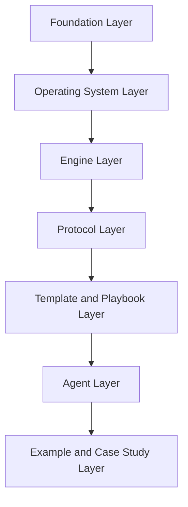
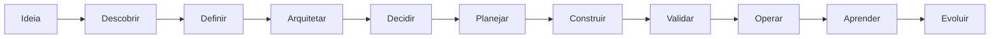

# Architecture Vision

## 1. Objetivo

Este documento define a visão arquitetural de longo prazo do AI-SEOS.

Ele estabelece como o framework deve ser estruturado, evoluído, modularizado e governado ao longo do tempo.

O objetivo não é apenas organizar arquivos. O objetivo é definir uma arquitetura de conhecimento e operação capaz de sustentar um framework open source vivo.

---

## 2. Visão arquitetural

O AI-SEOS deve ser construído como um sistema modular composto por camadas independentes, mas integradas.

---

## 3. Camadas arquiteturais

### 3.1 Foundation Layer

Contém:

- missão;
- visão;
- princípios;
- governança;
- roadmap;
- contribuição;
- changelog;
- estrutura do repositório;
- protocolo de desenvolvimento.

Esta camada define o DNA do framework.

### 3.2 Operating System Layer

Contém o núcleo operacional do AI-SEOS:

- Core Identity;
- Operating Model;
- Context Model;
- Knowledge Model;
- Decision Model;
- Artifact Model;
- Handoff Model;
- Quality Model;
- Reflection Model.

Esta camada define como o sistema funciona.

### 3.3 Engine Layer

Engines são capacidades operacionais especializadas.

Engines planejadas:

- Discovery Engine;
- Product Engine;
- Architecture Engine;
- Decision Engine;
- Risk Engine;
- Optimization Engine;
- Execution Engine;
- Documentation Engine;
- Handoff Engine;
- Reflection Engine.

### 3.4 Protocol Layer

Protocolos definem processos executáveis e repetíveis.

Exemplos:

- Project Discovery Protocol;
- Architecture Review Protocol;
- ADR Protocol;
- Risk Assessment Protocol;
- Handoff Protocol;
- Release Protocol;
- Retrospective Protocol.

### 3.5 Template and Playbook Layer

Templates padronizam artefatos.

Playbooks guiam execução em cenários recorrentes.

### 3.6 Agent Layer

Agentes especializados executam papéis dentro do sistema.

Exemplos:

- AI CTO;
- AI Product Owner;
- AI Solution Architect;
- AI Security Engineer;
- AI QA Lead;
- AI Implementation Lead;
- AI Documentation Architect;
- AI Reviewer.

### 3.7 Example and Case Study Layer

Exemplos reais demonstram aplicação do framework.

---

## 4. Princípios arquiteturais

### 4.1 Modularity

Cada módulo deve poder evoluir sem quebrar os demais.

### 4.2 Explicit Interfaces

Todo módulo deve declarar suas entradas, saídas e dependências.

### 4.3 Documentation as Architecture

No AI-SEOS, documentação não apenas descreve arquitetura. Ela é parte da arquitetura.

### 4.4 Replaceability

Módulos devem ser substituíveis quando uma abordagem melhor surgir.

### 4.5 Composability

Engines, protocolos, templates e agentes devem poder ser combinados.

### 4.6 Evolutionary Stability

O framework deve evoluir sem perder coerência.

---

## 5. Arquitetura conceitual do ciclo de vida

---

## 6. Horizonte de evolução

### 6.1 Horizonte de 2 anos

O AI-SEOS deve possuir:

- documentação central estável;
- engines principais completos;
- templates reutilizáveis;
- agentes operacionais;
- exemplos de projetos reais;
- comunidade inicial;
- contribuição documentada;
- primeiros casos de uso públicos.

### 6.2 Horizonte de 5 anos

O AI-SEOS deve evoluir para:

- referência pública em AI Software Engineering;
- ecossistema de agentes;
- integrações com ferramentas de desenvolvimento;
- biblioteca madura de playbooks;
- benchmark de qualidade de engenharia com IA;
- guias para empresas.

### 6.3 Horizonte de 10 anos

O AI-SEOS deve poder se tornar:

- padrão aberto para coordenação de equipes humano + IA;
- base para certificações;
- framework usado por consultorias e empresas;
- repositório de padrões de engenharia orientada por IA;
- referência comparável a frameworks clássicos de arquitetura, produto e engenharia.

---

## 7. Decisões arquiteturais iniciais

### 7.1 Markdown como formato primário

Markdown será usado como formato principal por ser simples, versionável, legível em texto puro e compatível com GitHub.

### 7.2 ADRs como mecanismo de decisão

ADRs serão usadas para decisões estruturais.

### 7.3 Mermaid como padrão de diagramas

Mermaid será usado por ser versionável, textual e integrado ao GitHub.

### 7.4 Modularidade por diretório

Cada grande área do framework terá diretório próprio.

---

## 8. Riscos arquiteturais

| Risco | Impacto | Mitigação |
|---|---:|---|
| Documentação excessiva sem uso prático | Alto | Exigir exemplos e templates executáveis |
| Duplicação entre módulos | Médio | Definir interfaces e owners |
| Ambiguidade de termos | Alto | Manter glossary |
| Crescimento desorganizado | Alto | Governança e ADRs obrigatórias |
| Dependência de um único agente | Médio | Documentos autocontidos e handoffs claros |

---

## 9. Definition of Done arquitetural

A arquitetura do AI-SEOS só é considerada saudável quando:

- possui módulos claros;
- possui interfaces explícitas;
- possui documentação navegável;
- possui decisões registradas;
- possui exemplos de uso;
- possui governança de mudança;
- possui roadmap de evolução;
- reduz ambiguidade em vez de aumentá-la.
