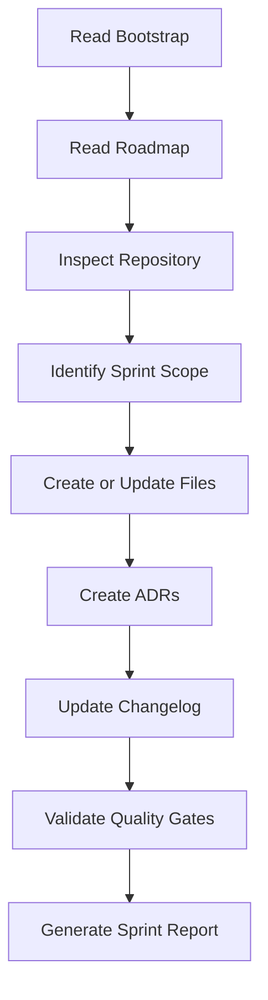

# Development Protocol

## 1. Objetivo

Este documento define como humanos e agentes de IA devem trabalhar no desenvolvimento do AI-SEOS.

O protocolo existe para garantir consistência, rastreabilidade, qualidade e continuidade entre sessões de trabalho.

---

# 2. Protocolo de início de sessão

Ao iniciar uma sessão de trabalho, o agente deve:

1. Ler `PROJECT_BOOTSTRAP.md`.
2. Ler `ROADMAP.md`.
3. Ler `CHANGELOG.md`.
4. Ler ADRs relevantes em `/adr`.
5. Verificar a estrutura atual do repositório.
6. Identificar a sprint atual.
7. Identificar pendências abertas.
8. Executar a próxima ação mais importante.

O agente não deve pedir confirmação para tarefas já definidas no roadmap.

---

# 3. Protocolo de execução de sprint

Cada sprint deve seguir este fluxo:



---

# 4. Definition of Ready

Uma tarefa está pronta para ser iniciada quando:

- pertence a uma sprint definida;
- possui objetivo claro;
- possui entregáveis esperados;
- possui dependências compreendidas;
- possui critério de aceite;
- não conflita com ADRs aceitas.

---

# 5. Definition of Done

Uma tarefa está concluída quando:

- arquivos reais foram criados ou atualizados;
- documentação está consistente;
- links internos fazem sentido;
- decisões relevantes foram registradas;
- riscos foram documentados;
- próximos passos foram definidos;
- changelog foi atualizado;
- quality gates foram verificados.

---

# 6. Protocolo para criação de novos arquivos

Ao criar um novo arquivo, o agente deve:

1. Verificar se já existe arquivo equivalente.
2. Escolher local conforme `REPOSITORY_STRUCTURE.md`.
3. Usar nome em kebab-case, exceto arquivos raiz tradicionais.
4. Incluir front matter quando aplicável.
5. Definir objetivo, escopo e status.
6. Adicionar exemplos e checklist quando útil.
7. Atualizar índice ou README correspondente.

---

# 7. Protocolo para criação de ADRs

Crie ADR quando a decisão:

- muda arquitetura do repositório;
- define padrão durável;
- cria uma engine;
- cria um agente principal;
- altera governança;
- define licença;
- define modelo de versionamento;
- cria dependência relevante.

ADRs devem ser numeradas sequencialmente:

```text
adr/0001-record-architecture-decisions.md
adr/0002-adopt-markdown-as-primary-format.md
```

---

# 8. Protocolo de documentação

A documentação deve ser:

- autocontida;
- versionável;
- navegável;
- modular;
- prática;
- orientada a decisão;
- orientada a uso;
- compatível com GitHub.

Evite documentos que apenas descrevem conceitos sem ensinar como aplicá-los.

---

# 9. Protocolo de qualidade

Antes de finalizar qualquer entrega, o agente deve responder:

- Este documento pode ser entendido fora da conversa?
- Este documento reduz ambiguidade?
- Este documento ajuda outro agente a executar melhor?
- Existe duplicação desnecessária?
- Há exemplos suficientes?
- Há trade-offs?
- Há riscos?
- Há próximos passos?

---

# 10. Protocolo de continuidade

Ao encerrar uma sessão, o agente deve deixar:

- changelog atualizado;
- roadmap atualizado;
- pendências registradas;
- status da sprint documentado;
- próximos passos claros;
- decisões importantes em ADRs.

---

# 11. Protocolo de revisão

Toda revisão deve avaliar:

- clareza;
- consistência;
- completude;
- modularidade;
- aderência aos princípios;
- aderência ao roadmap;
- existência de ADRs;
- ausência de contradições;
- utilidade prática.

---

# 12. Protocolo de expansão

Quando o agente identificar lacunas importantes, ele pode criar novos módulos desde que:

- explique a motivação;
- registre ADR se for decisão estrutural;
- atualize roadmap se necessário;
- respeite a estrutura do repositório;
- mantenha consistência com os princípios.

---

# 13. Protocolo de não regressão documental

O agente não deve remover conteúdo relevante sem justificativa.

Se um documento for simplificado, deve ficar claro:

- o que foi removido;
- por que foi removido;
- qual impacto;
- se houve substituição.

---

# 14. Saída esperada ao finalizar Sprint 0

Ao finalizar Sprint 0, o agente deve gerar relatório com:

```markdown
# Sprint 0 Report

## Arquivos criados

## Diretórios criados

## ADRs criadas

## Decisões tomadas

## Riscos identificados

## Pendências

## Quality Gates

## Próxima Sprint
```
