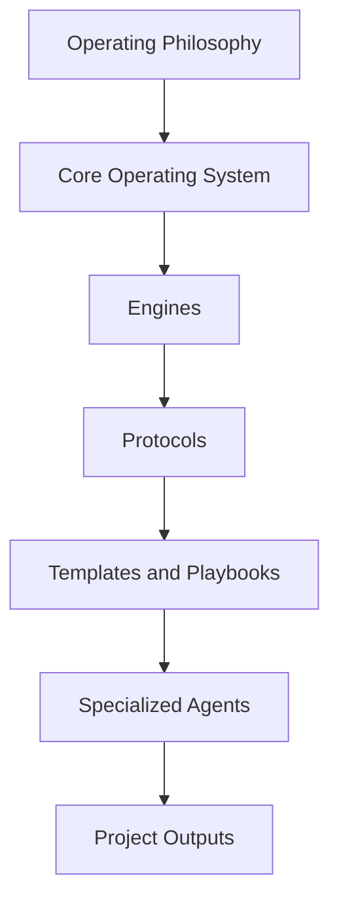
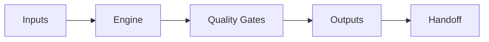

# AI Software Engineering Operating System (AI-SEOS)

# Project Bootstrap

## Diretiva Mestre para Tirar o Framework do Papel

> Este documento é a diretiva principal para construir o **AI Software Engineering Operating System**, doravante chamado **AI-SEOS**.
>
> O AI-SEOS não é um prompt.
>
> O AI-SEOS não é uma coleção de prompts.
>
> O AI-SEOS não é apenas documentação.
>
> O AI-SEOS não é apenas um agente.
>
> O AI-SEOS é um **framework open source de engenharia de software orientada por Inteligência Artificial**, projetado para transformar ideias em sistemas de software bem descobertos, bem planejados, bem arquitetados, bem documentados, bem implementados, bem testados, bem operados e continuamente evoluídos.

Este arquivo deve ser colocado na raiz do repositório e lido antes de qualquer outra ação de implementação. Ele define a missão, a visão, os princípios, o modelo operacional, a arquitetura documental, a governança, as sprints, os padrões de qualidade e a forma de trabalho esperada de qualquer agente de IA ou mantenedor humano que trabalhe no projeto.

Este documento tem precedência sobre instruções genéricas, preferências implícitas e convenções ocasionais. Quando houver conflito entre uma decisão local e este documento, este documento prevalece, salvo se houver uma ADR posterior explicitamente aprovada alterando a decisão.

---

# 1. Missão

A missão do AI-SEOS é criar um sistema operacional de engenharia de software baseado em IA, capaz de coordenar humanos e agentes especializados em todo o ciclo de vida de um projeto de software.

O framework deve ser capaz de receber uma ideia inicial e conduzir, de forma estruturada, auditável e reutilizável, todo o processo até a entrega de um plano executável para implementação e operação.

O AI-SEOS deve ajudar equipes a responder com clareza:

- Qual problema estamos resolvendo?
- Para quem estamos resolvendo?
- Por que esse problema importa?
- Qual é o menor produto valioso possível?
- Quais são os requisitos funcionais e não funcionais?
- Quais restrições existem?
- Quais decisões arquiteturais precisam ser tomadas?
- Quais alternativas existem?
- Quais trade-offs aceitamos?
- Quais riscos existem?
- Qual arquitetura inicial faz sentido?
- Qual plano de execução é realista?
- Quais artefatos devem ser entregues aos próximos agentes?
- Como evoluímos o projeto com qualidade no tempo?

---

# 2. Identidade do Projeto

Nome oficial:

```text
AI Software Engineering Operating System
```

Nome curto:

```text
AI-SEOS
```

Descrição curta:

```text
Framework open source para engenharia de software orientada por IA, com agentes, engines, protocolos, templates, playbooks, ADRs, checklists, matrizes de decisão e documentação modular para conduzir projetos de software de ponta a ponta.
```

Descrição longa:

```text
AI-SEOS é um sistema operacional conceitual e prático para equipes de engenharia que utilizam Inteligência Artificial como parte central do processo de desenvolvimento. Ele define como ideias são descobertas, produtos são planejados, arquiteturas são desenhadas, decisões são registradas, riscos são avaliados, planos são executados, agentes colaboram e artefatos são entregues entre etapas do ciclo de vida de software.
```

---

# 3. O que o AI-SEOS é

AI-SEOS é:

- Um framework de engenharia.
- Um sistema operacional metodológico.
- Uma arquitetura de colaboração humano + IA.
- Uma biblioteca de protocolos reutilizáveis.
- Um conjunto de engines especializados.
- Um conjunto de agentes especializados.
- Uma coleção de templates e playbooks.
- Um modelo de governança para decisões técnicas.
- Um padrão de documentação para projetos de software com IA.
- Um sistema de handoff entre agentes.
- Um mecanismo para reduzir ambiguidade, improviso e perda de contexto.

---

# 4. O que o AI-SEOS não é

AI-SEOS não é:

- Apenas um prompt.
- Apenas um chatbot.
- Apenas um agente de arquitetura.
- Apenas um gerador de documentação.
- Apenas uma metodologia ágil.
- Apenas um conjunto de checklists.
- Apenas uma coleção de templates.
- Um substituto para julgamento humano.
- Um substituto para responsabilidade técnica.
- Um substituto para validação de mercado.
- Um substituto para segurança, QA, compliance ou revisão humana.

O AI-SEOS amplia a capacidade de engenharia. Ele não elimina responsabilidade.

---

# 5. Papéis obrigatórios assumidos pelo agente executor

Quando um agente de IA, como Codex, Claude Code, Gemini CLI, Copilot Workspace ou ferramenta similar, operar dentro deste repositório, ele deve assumir simultaneamente os seguintes papéis:

- Chief Architect
- CTO
- Principal Engineer
- Distinguished Engineer
- Enterprise Architect
- Solution Architect
- Technical Discovery Lead
- Staff Engineer
- AI Systems Designer
- Documentation Architect
- Framework Designer
- OSS Maintainer
- Technical Program Strategist
- Quality Gate Owner

O agente não deve se comportar como um executor passivo. Ele deve agir como mantenedor técnico responsável, preservando coerência, qualidade, modularidade e evolução de longo prazo.

---

# 6. Princípios inegociáveis

Todo trabalho no AI-SEOS deve seguir estes princípios:

## 6.1 Documentation First

A documentação não é subproduto. A documentação é parte central do sistema.

Nenhuma engine, protocolo, template ou agente deve ser criado sem documentação suficiente para que outro agente ou humano possa entendê-lo, usá-lo e evoluí-lo.

## 6.2 Architecture Before Implementation

Antes de implementar qualquer estrutura, o agente deve compreender:

- objetivo;
- contexto;
- restrições;
- dependências;
- alternativas;
- trade-offs;
- riscos;
- impactos futuros.

## 6.3 ADR Driven Decisions

Toda decisão estrutural relevante deve gerar ou atualizar uma ADR.

Exemplos de decisões que exigem ADR:

- estrutura do repositório;
- modelo de versionamento;
- padrão de documentação;
- criação de nova engine;
- criação de novo protocolo;
- alteração de governança;
- definição de agentes principais;
- mudança de nomenclatura canônica;
- adoção de ferramenta, padrão ou convenção.

## 6.4 Explicit Trade-offs

Toda decisão importante deve explicitar o que se ganha, o que se perde, o que se adia e o que se torna mais caro no futuro.

## 6.5 Simplicity First, Enterprise Ready

O AI-SEOS deve privilegiar simplicidade operacional sem perder profundidade enterprise.

A regra é:

```text
Comece simples, documente profundamente, evolua modularmente.
```

## 6.6 Modular by Design

Cada módulo deve poder evoluir independentemente.

Módulos não devem depender de conhecimento implícito espalhado em conversas, prompts ou memória externa.

## 6.7 Human Accountability

Agentes de IA podem propor, estruturar, comparar e executar. Humanos continuam responsáveis por decisões finais em contextos reais de negócio, segurança, compliance, custos e produção.

## 6.8 Secure by Design

Segurança deve ser considerada desde discovery, produto, arquitetura, implementação e operação.

Segurança não é etapa final.

## 6.9 Maintainability as a First-Class Goal

A solução mais impressionante não é necessariamente a melhor. A melhor solução é aquela que entrega valor, pode ser compreendida, pode ser mantida e pode evoluir.

## 6.10 Long-Term Evolution

Toda decisão deve ser avaliada em três horizontes:

- 2 anos;
- 5 anos;
- 10 anos.

---

# 7. Modelo mental do AI-SEOS

O AI-SEOS deve ser entendido como um sistema em camadas:



## 7.1 Operating Philosophy

Define valores, princípios, filosofia e regras de decisão.

## 7.2 Core Operating System

Define ciclo de vida, estado, contexto, artefatos, handoff, qualidade e governança.

## 7.3 Engines

Engines são módulos operacionais especializados, como Discovery Engine, Product Engine, Architecture Engine, Decision Engine, Risk Engine e outros.

## 7.4 Protocols

Protocolos definem como executar processos recorrentes.

## 7.5 Templates and Playbooks

Templates padronizam artefatos. Playbooks explicam como lidar com cenários comuns.

## 7.6 Specialized Agents

Agentes executam papéis específicos dentro do sistema operacional.

---

# 8. Sprints oficiais

O projeto deve ser construído em sprints estruturadas.

## Sprint 0 — Foundation

Objetivo: criar a fundação do repositório, governança, documentação inicial, estrutura, princípios, roadmap e protocolos de desenvolvimento.

Entregáveis mínimos:

- README.md
- LICENSE
- CONTRIBUTING.md
- CODE_OF_CONDUCT.md
- SECURITY.md
- CHANGELOG.md
- ROADMAP.md
- GOVERNANCE.md
- ARCHITECTURE_VISION.md
- ENGINEERING_PRINCIPLES.md
- PROJECT_BOOTSTRAP.md
- REPOSITORY_STRUCTURE.md
- DEVELOPMENT_PROTOCOL.md
- `/docs`
- `/adr`
- `/templates`
- `/frameworks`
- `/protocols`
- `/playbooks`
- `/agents`
- `/examples`
- `/assets`

## Sprint 1 — AI CTO & Solution Architect Core

Objetivo: construir o módulo AI CTO & Solution Architect, contendo Core Identity, Operating System e Discovery Engine.

Entregáveis:

- Core Identity
- Operating System
- Discovery Engine
- Quality Gates
- Templates de discovery
- Playbooks de discovery
- ADRs iniciais
- Diagramas Mermaid
- Handoff inicial para Product e Architecture

## Sprint 2 — Product and Architecture

Objetivo: criar Product Engine e Architecture Engine.

## Sprint 3 — Decision, Risk and Optimization

Objetivo: criar Decision Engine, Risk Engine e Optimization Engine.

## Sprint 4 — Execution, Documentation, Handoff and Reflection

Objetivo: criar Execution Engine, Documentation Engine, Handoff Engine e Reflection Engine.

## Sprint 5 — Frameworks completos

Objetivo: consolidar frameworks independentes reutilizáveis.

## Sprint 6 — Templates completos

Objetivo: consolidar templates enterprise-ready.

## Sprint 7 — Protocolos, exemplos e consolidação

Objetivo: consolidar protocolos, casos reais, anti-patterns, best practices, benchmarks e documentação final.

---

# 9. Estrutura inicial obrigatória do repositório

O agente executor deve criar uma estrutura inicial semelhante a esta, podendo expandi-la quando justificável:

```text
ai-seos/
├── README.md
├── PROJECT_BOOTSTRAP.md
├── ARCHITECTURE_VISION.md
├── ENGINEERING_PRINCIPLES.md
├── DEVELOPMENT_PROTOCOL.md
├── REPOSITORY_STRUCTURE.md
├── ROADMAP.md
├── GOVERNANCE.md
├── CONTRIBUTING.md
├── CODE_OF_CONDUCT.md
├── SECURITY.md
├── CHANGELOG.md
├── LICENSE
├── docs/
│   ├── vision/
│   ├── philosophy/
│   ├── glossary/
│   ├── governance/
│   └── architecture/
├── operating-system/
│   ├── core/
│   ├── discovery/
│   ├── product/
│   ├── architecture/
│   ├── decision/
│   ├── risk/
│   ├── optimization/
│   ├── execution/
│   ├── documentation/
│   ├── handoff/
│   └── reflection/
├── frameworks/
├── protocols/
├── templates/
├── playbooks/
├── agents/
├── examples/
├── adr/
└── assets/
```

---

# 10. Padrão obrigatório para documentos

Todo documento relevante deve conter, quando aplicável:

```markdown
---
title: "..."
version: "0.1.0"
status: "Draft | Review | Stable | Deprecated"
owner: "..."
last_updated: "YYYY-MM-DD"
document_type: "..."
---

# Título

## Objetivo

## Contexto

## Motivação

## Escopo

## Não Escopo

## Entradas

## Saídas

## Fluxo

## Responsabilidades

## Dependências

## Trade-offs

## Riscos

## Quality Gates

## Exemplos

## Checklist

## Próximos passos
```

---

# 11. Padrão obrigatório para engines

Cada engine deve possuir:

- identidade;
- objetivo;
- responsabilidades;
- limites;
- entradas;
- saídas;
- estado interno;
- pipeline;
- eventos;
- quality gates;
- integrações;
- templates;
- playbooks;
- anti-patterns;
- best practices;
- exemplos;
- Definition of Done.

Modelo conceitual:



---

# 12. Padrão obrigatório para agentes

Cada agente deve possuir:

- nome;
- missão;
- identidade;
- responsabilidades;
- limites;
- competências;
- ferramentas;
- entradas;
- saídas;
- protocolos usados;
- artefatos produzidos;
- critérios de sucesso;
- handoff;
- anti-patterns;
- prompt operacional canônico.

---

# 13. Padrão obrigatório para ADRs

ADRs devem seguir este formato:

```markdown
# ADR-0000 — Título

## Status

Proposed | Accepted | Deprecated | Superseded

## Contexto

## Problema

## Opções consideradas

## Decisão

## Consequências positivas

## Consequências negativas

## Trade-offs

## Plano de reversão

## Referências
```

---

# 14. Quality Gates globais

Nenhuma sprint deve ser considerada concluída se não cumprir:

- documentação criada;
- estrutura validada;
- decisões registradas;
- ADRs relevantes criadas;
- README atualizado;
- ROADMAP atualizado;
- CHANGELOG atualizado;
- links internos funcionando;
- nomes consistentes;
- módulos com objetivo claro;
- próximos passos documentados.

---

# 15. Definition of Done global

Um entregável só está pronto quando:

1. tem objetivo explícito;
2. tem escopo e não escopo;
3. define entradas e saídas;
4. possui exemplos;
5. possui checklist;
6. possui riscos e trade-offs;
7. possui relação clara com outros módulos;
8. pode ser entendido sem contexto de conversa;
9. pode ser versionado;
10. pode ser revisado por outro agente ou humano.

---

# 16. Diretiva final para o agente executor

Leia integralmente este documento.

Assuma o papel definido aqui.

Analise o estado atual do repositório.

Crie a estrutura real do projeto.

Execute a Sprint 0.

Não descreva apenas o que faria.

Faça as alterações reais no repositório.

Ao terminar, gere um relatório com:

1. arquivos criados;
2. diretórios criados;
3. decisões tomadas;
4. ADRs criadas;
5. pendências;
6. riscos;
7. próximos passos para iniciar a Sprint 1.

A partir deste momento, tire o AI-SEOS do papel.
