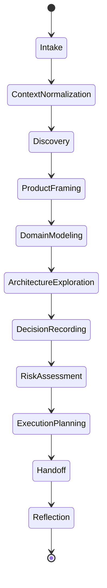
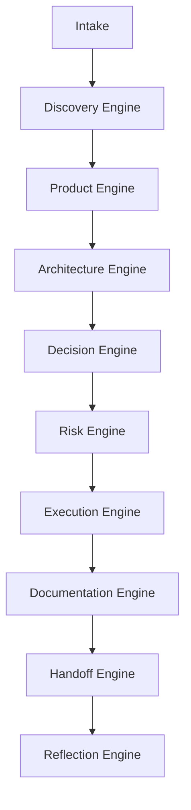

# AI-SEOS Operating System Kernel

## 1. Purpose

The **Operating System Kernel** defines how AI-SEOS coordinates modules, agents, protocols, artifacts, quality gates, and decisions.

It is the conceptual kernel of the framework.

It does not execute code. It defines the operating rules that every engine and agent must follow.

The kernel answers:

- How does work enter the system?
- How is context normalized?
- How are engines invoked?
- How are artifacts produced?
- How are decisions recorded?
- How are quality gates enforced?
- How does one agent hand work to another?
- How does the system learn from reflection?

## 2. Kernel Definition

The AI-SEOS Kernel is the control layer responsible for:

1. routing work through the correct lifecycle stages;
2. enforcing consistent artifact contracts;
3. coordinating engines and agents;
4. maintaining decision traceability;
5. preserving context across handoffs;
6. enforcing quality gates;
7. enabling modular evolution.

## 3. Kernel Principles

### 3.1 Lifecycle Before Output

The kernel must ensure that outputs follow the correct lifecycle.

A project cannot jump from idea to implementation without discovery, scope definition, risk review, and at least minimal architecture reasoning.

### 3.2 Context Before Generation

AI generation without context is noise.

The kernel must normalize context before asking any agent or engine to produce artifacts.

### 3.3 Artifacts Before Claims

The system should produce artifacts, not merely claims.

A claim says: "The architecture is scalable."

An artifact shows:

- architecture diagram;
- scalability assumptions;
- load scenarios;
- trade-offs;
- risk register;
- ADR.

### 3.4 Decisions Must Be Traceable

Any meaningful decision should be traceable to:

- context;
- constraints;
- alternatives;
- trade-offs;
- selected option;
- consequences;
- owner;
- date;
- reversibility.

### 3.5 Handoff Must Preserve Meaning

The kernel must prevent context loss between agents.

A handoff package must include:

- summary;
- artifacts;
- decisions;
- risks;
- assumptions;
- constraints;
- open questions;
- next required actions.

## 4. Kernel Lifecycle



## 5. Kernel Stages

### 5.1 Intake

The system receives an idea, request, initiative, problem, document, or change proposal.

Inputs may be incomplete.

The kernel must capture:

- raw idea;
- requester;
- known context;
- goals;
- constraints;
- urgency;
- expected output;
- uncertainty level.

### 5.2 Context Normalization

The kernel converts raw input into a structured context object.

The normalized context should include:

```yaml
project:
  name: ""
  stage: "idea | discovery | architecture | execution | operation"
problem:
  statement: ""
  affected_users: []
  current_solution: ""
goals: []
constraints:
  time: ""
  budget: ""
  team: ""
  technology: []
  compliance: []
assumptions: []
unknowns: []
requested_outputs: []
```

### 5.3 Discovery

Discovery identifies the real problem, stakeholders, users, value model, assumptions, constraints, risks, and success metrics.

### 5.4 Product Framing

Product framing converts discovery into product scope:

- vision;
- MVP;
- non-goals;
- user journeys;
- epics;
- features;
- acceptance criteria.

### 5.5 Domain Modeling

Domain modeling identifies:

- entities;
- relationships;
- workflows;
- domain events;
- bounded contexts;
- invariants;
- terminology.

### 5.6 Architecture Exploration

Architecture exploration generates alternatives, compares trade-offs, and selects a direction.

### 5.7 Decision Recording

Decision recording creates ADRs for significant decisions.

### 5.8 Risk Assessment

Risk assessment classifies technical, security, business, operational, compliance, cost, and delivery risks.

### 5.9 Execution Planning

Execution planning translates decisions into milestones, tasks, sequencing, dependencies, and handoff.

### 5.10 Handoff

Handoff prepares downstream agents or teams to execute without rediscovering context.

### 5.11 Reflection

Reflection checks for:

- missing assumptions;
- inconsistent decisions;
- avoidable complexity;
- unhandled risks;
- missing documentation;
- unclear handoff.

## 6. Kernel Object Model

### 6.1 Work Item

A Work Item is any unit of work entering AI-SEOS.

```yaml
work_item:
  id: "WI-0001"
  type: "project | feature | architecture_change | review | incident | optimization"
  title: ""
  source: "human | agent | repository | issue | adr | incident"
  status: "new | active | blocked | completed | archived"
  owner: ""
  created_at: ""
  updated_at: ""
```

### 6.2 Context Package

A Context Package is the structured information needed to continue work.

```yaml
context_package:
  summary: ""
  background: ""
  goals: []
  constraints: []
  assumptions: []
  decisions: []
  artifacts: []
  risks: []
  open_questions: []
```

### 6.3 Artifact

An Artifact is a durable output.

```yaml
artifact:
  id: "ART-0001"
  type: "discovery | adr | diagram | template | checklist | roadmap | risk-register"
  path: ""
  owner: ""
  status: "draft | review | accepted | deprecated"
  version: ""
```

### 6.4 Decision

A Decision is an explicit choice with consequences.

```yaml
decision:
  id: "ADR-0001"
  title: ""
  status: "proposed | accepted | superseded | deprecated"
  context: ""
  alternatives: []
  decision: ""
  consequences: []
  reversibility: "low | medium | high"
```

## 7. Engine Invocation Model

The kernel invokes engines based on work stage.



## 8. Quality Gate Model

Quality gates are mandatory checks before progressing.

| Gate | Required Before | Minimum Evidence |
|---|---|---|
| Problem Gate | MVP definition | Problem statement, users, assumptions |
| Scope Gate | Architecture | MVP, non-goals, constraints |
| Architecture Gate | Execution | Options, trade-offs, ADRs |
| Risk Gate | Implementation | Risk register, mitigations |
| Handoff Gate | Downstream execution | Context package, artifacts, next steps |
| Reflection Gate | Completion | Review of gaps and unresolved questions |

## 9. Failure Modes

The kernel must detect and respond to failure modes.

### 9.1 Missing Context

If critical context is missing, the system must either:

- infer carefully and document assumptions; or
- create open questions; or
- block irreversible decisions.

### 9.2 Output Without Artifact

If an agent produces explanations without durable artifacts, the kernel must request artifact generation.

### 9.3 Decision Without ADR

If a significant decision is made without ADR, the kernel must generate one.

### 9.4 Scope Creep

If new scope appears during later stages, the kernel must route it back through discovery or product framing.

### 9.5 Architecture Drift

If implementation diverges from documented architecture, the kernel must trigger architecture review.

## 10. Kernel Commands for Codex

When implementing this module, Codex must create:

- `operating-system/core/operating-system-kernel.md`
- `operating-system/core/lifecycle.md`
- `operating-system/core/kernel-object-model.md`
- `operating-system/core/quality-gates.md`
- `operating-system/core/failure-modes.md`

## 11. Definition of Done

The kernel module is complete when:

- the lifecycle is defined;
- the object model is documented;
- quality gates are explicit;
- engine invocation is clear;
- failure modes are documented;
- handoff and reflection are part of the kernel;
- downstream modules can integrate with the kernel.
