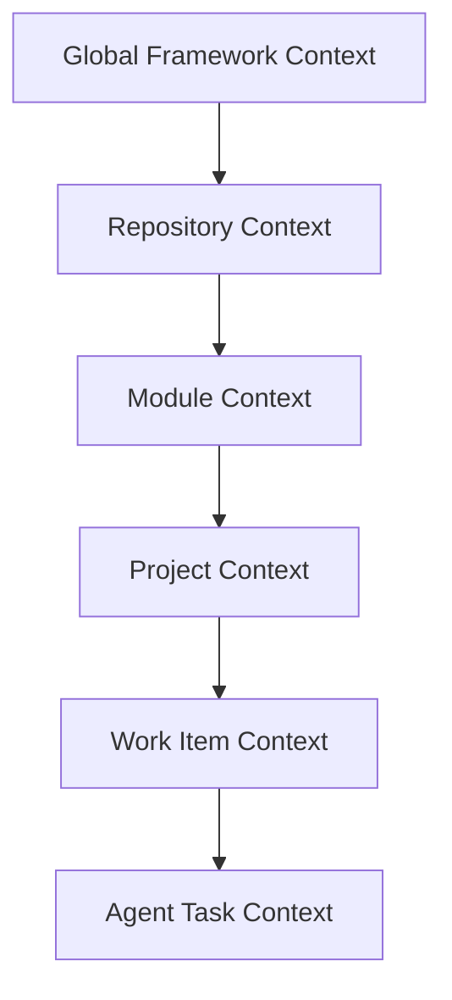
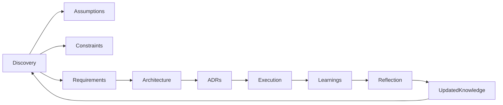

# AI-SEOS Context and Knowledge Model

## 1. Purpose

AI-assisted engineering fails when context is fragmented, implicit, stale, or lost during handoff.

The **Context and Knowledge Model** defines how AI-SEOS captures, structures, validates, transfers, and evolves engineering knowledge.

It exists to prevent repeated rediscovery.

## 2. Definitions

### 2.1 Context

Context is the set of information needed to make a correct decision or produce a useful artifact in a specific situation.

Context includes:

- goals;
- users;
- constraints;
- assumptions;
- decisions;
- risks;
- domain terminology;
- architecture state;
- current progress;
- unresolved questions.

### 2.2 Knowledge

Knowledge is validated, reusable, and durable information produced by the system.

Examples:

- accepted ADRs;
- validated discovery findings;
- stable domain models;
- approved architecture diagrams;
- accepted principles;
- reusable templates;
- lessons learned.

### 2.3 Assumption

An assumption is a belief treated as true for planning purposes but not yet fully validated.

Assumptions must never be hidden.

### 2.4 Decision

A decision is a selected path among alternatives, with consequences.

### 2.5 Memory

Memory is the durable repository of context and knowledge.

In AI-SEOS, memory is primarily documentation, not ephemeral chat history.

## 3. Context Layers

AI-SEOS uses layered context.



### 3.1 Global Framework Context

Stable AI-SEOS principles, governance, lifecycle, and definitions.

Examples:

- PROJECT_BOOTSTRAP.md
- ENGINEERING_PRINCIPLES.md
- GOVERNANCE.md
- REPOSITORY_STRUCTURE.md

### 3.2 Repository Context

The current state of the repository.

Includes:

- existing files;
- ADRs;
- roadmap;
- changelog;
- module versions;
- open issues;
- pending work.

### 3.3 Module Context

The context specific to one module.

Examples:

- Discovery Engine;
- Architecture Engine;
- Risk Engine;
- AI CTO Agent.

### 3.4 Project Context

Context for a specific software project being analyzed by AI-SEOS.

Includes:

- business idea;
- product goals;
- stakeholders;
- constraints;
- domain;
- architecture decisions.

### 3.5 Work Item Context

Context for a specific task, feature, decision, review, or handoff.

### 3.6 Agent Task Context

The immediate context provided to a specialized agent.

This must be precise, bounded, and actionable.

## 4. Context Package Standard

Every handoff must include a context package.

```yaml
context_package:
  title: ""
  purpose: ""
  source_agent: ""
  target_agent: ""
  created_at: ""
  status: "draft | ready | accepted | blocked"
  summary: ""
  background: ""
  goals: []
  non_goals: []
  stakeholders: []
  users: []
  assumptions: []
  constraints: []
  decisions: []
  artifacts: []
  risks: []
  dependencies: []
  open_questions: []
  next_actions: []
```

## 5. Assumption Register

Every project must maintain an assumption register.

```yaml
assumption:
  id: "ASM-0001"
  statement: ""
  category: "business | product | technical | security | cost | delivery | compliance"
  confidence: "low | medium | high"
  impact_if_wrong: "low | medium | high | critical"
  validation_method: ""
  owner: ""
  status: "open | validated | invalidated | accepted-risk"
```

### 5.1 Assumption Rules

- Assumptions must be written as explicit statements.
- Assumptions must be testable where possible.
- High-impact assumptions must be validated early.
- Invalidated assumptions must trigger review of dependent decisions.
- Assumptions accepted as risk must appear in the risk register.

## 6. Constraint Register

Constraints shape architecture and execution.

```yaml
constraint:
  id: "CON-0001"
  category: "time | budget | team | technology | legal | compliance | operational | security"
  statement: ""
  flexibility: "fixed | negotiable | unknown"
  impact: "low | medium | high | critical"
  affected_decisions: []
```

## 7. Knowledge Types

### 7.1 Stable Knowledge

Rarely changes.

Examples:

- engineering principles;
- governance;
- documentation standards.

### 7.2 Evolving Knowledge

Changes as the project evolves.

Examples:

- roadmap;
- module scope;
- architecture decisions;
- templates.

### 7.3 Volatile Knowledge

Changes frequently.

Examples:

- sprint status;
- temporary blockers;
- open questions.

## 8. Knowledge Freshness

Every important artifact must indicate freshness.

Recommended metadata:

```yaml
version: ""
status: "draft | review | stable | deprecated"
last_updated: "YYYY-MM-DD"
review_cycle: ""
owner: ""
```

## 9. Context Integrity Rules

### 9.1 No Orphan Decisions

A decision must link to context.

### 9.2 No Orphan Artifacts

An artifact must have a purpose and owner.

### 9.3 No Silent Assumptions

An assumption must be listed or removed.

### 9.4 No Stale Handoffs

A handoff package must reflect current decisions.

### 9.5 No Ambiguous Scope

If scope is unclear, it must be clarified or explicitly marked as open.

## 10. Context Compression

AI agents often need condensed context.

AI-SEOS uses three levels:

### 10.1 Full Context

Complete documentation package.

### 10.2 Working Context

Relevant subset for a task.

### 10.3 Handoff Summary

Short operational package for downstream action.

## 11. Context Drift

Context drift happens when outputs no longer match the current state of decisions and constraints.

Triggers:

- new ADR supersedes old ADR;
- roadmap changes;
- project scope changes;
- security requirement changes;
- implementation diverges from architecture.

Response:

1. identify affected artifacts;
2. mark stale artifacts;
3. update dependent documents;
4. record decision if necessary;
5. notify downstream agents.

## 12. Knowledge Flow



## 13. Codex Implementation Instructions

Create or update:

- `operating-system/core/context-and-knowledge-model.md`
- `operating-system/core/context-package-standard.md`
- `templates/context/context-package-template.md`
- `templates/context/assumption-register-template.md`
- `templates/context/constraint-register-template.md`

Create directory if missing:

- `templates/context/`

## 14. Definition of Done

This module is complete when:

- context layers are documented;
- context package standard exists;
- assumption and constraint registers exist;
- knowledge freshness rules are defined;
- context drift rules are documented;
- templates are available for reuse.
