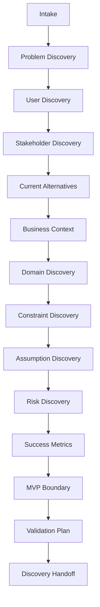

# AI-SEOS Discovery Engine

## 1. Purpose

The **Discovery Engine** transforms incomplete ideas into structured understanding.

It exists because most software failures begin before implementation:

- the wrong problem is solved;
- the user is misunderstood;
- the buyer is unclear;
- assumptions are hidden;
- constraints are discovered too late;
- MVP scope is uncontrolled;
- technical architecture is chosen prematurely.

The Discovery Engine prevents premature solutioning.

## 2. Mission

> Identify the real problem, stakeholders, users, business value, constraints, assumptions, risks, and validation path before product or architecture decisions are finalized.

## 3. Discovery Philosophy

Discovery is not a meeting.

Discovery is a structured engineering process.

It must produce artifacts that downstream agents can use.

A discovery output must be clear enough for:

- a Product Agent to refine the MVP;
- an Architecture Agent to identify system boundaries;
- a Security Agent to assess risk;
- an Implementation Lead to plan execution;
- a QA Agent to define test strategy;
- a human sponsor to approve direction.

## 4. Discovery Scope

The Discovery Engine covers:

1. problem discovery;
2. user discovery;
3. buyer and stakeholder discovery;
4. market and alternative discovery;
5. business model discovery;
6. domain discovery;
7. technical discovery;
8. constraint discovery;
9. assumption discovery;
10. risk discovery;
11. success metric definition;
12. MVP boundary definition;
13. validation planning;
14. handoff preparation.

## 5. Discovery Non-Scope

The Discovery Engine does not:

- finalize detailed architecture;
- implement code;
- replace product ownership;
- approve legal/compliance conclusions;
- guarantee product-market fit;
- produce final UI design;
- skip human validation for strategic decisions.

## 6. Discovery Pipeline

## 7. Discovery Stages

### 7.1 Intake

Capture the raw idea.

Questions:

- What is the idea?
- Who requested it?
- Why now?
- What triggered the need?
- What output is expected?
- Is this a new product, feature, migration, internal tool, or optimization?

Outputs:

- raw idea statement;
- initial context;
- initial unknowns;
- discovery mode selection.

### 7.2 Problem Discovery

Clarify the problem.

Questions:

- What pain exists today?
- Who experiences the pain?
- How often does it happen?
- How severe is it?
- What happens if it is not solved?
- Is this a real problem or a proposed solution looking for a problem?

Outputs:

- problem statement;
- pain evidence;
- affected segments;
- severity hypothesis.

### 7.3 User Discovery

Identify users and usage context.

Questions:

- Who uses the system?
- Are users and buyers the same?
- What is their workflow?
- What tools do they use today?
- What technical literacy do they have?
- What environment do they operate in?
- What motivates adoption?
- What causes abandonment?

Outputs:

- user segments;
- personas;
- jobs-to-be-done;
- workflow notes;
- adoption barriers.

### 7.4 Stakeholder Discovery

Identify decision makers and affected parties.

Questions:

- Who pays?
- Who approves?
- Who operates?
- Who supports?
- Who is affected indirectly?
- Who can block the initiative?
- Who owns success?

Outputs:

- stakeholder map;
- buyer/user distinction;
- decision authority;
- support responsibilities.

### 7.5 Current Alternatives

Understand the current solution landscape.

Questions:

- How is the problem solved today?
- What manual process exists?
- What competitors or substitutes exist?
- Why are current solutions insufficient?
- What switching costs exist?
- What makes the proposed solution meaningfully different?

Outputs:

- alternatives list;
- current workflow;
- competitor/substitute notes;
- differentiation hypothesis.

### 7.6 Business Context

Clarify the value model.

Questions:

- What business outcome is expected?
- How will value be measured?
- What is the revenue model or cost-saving model?
- What is the expected adoption path?
- What constraints exist around pricing, budget, or timeline?

Outputs:

- business objectives;
- success metrics;
- pricing/value hypotheses;
- constraints.

### 7.7 Domain Discovery

Identify domain language and core concepts.

Questions:

- What are the main entities?
- What workflows exist?
- What events matter?
- What rules must always hold true?
- What terminology do users use?
- What domain boundaries are visible?

Outputs:

- glossary candidates;
- entity list;
- workflow map;
- domain events;
- invariants.

### 7.8 Technical Discovery

Identify technical context without prematurely selecting architecture.

Questions:

- What systems must integrate?
- What data will be stored?
- What authentication is needed?
- What scale is expected?
- What latency matters?
- What compliance requirements exist?
- What platform constraints exist?
- What AI capabilities are required, if any?

Outputs:

- technical constraints;
- integration candidates;
- data sensitivity notes;
- non-functional requirement candidates.

### 7.9 Constraint Discovery

Document limitations.

Categories:

- time;
- budget;
- team;
- technology;
- compliance;
- market;
- operations;
- security;
- vendor;
- data.

Outputs:

- constraint register.

### 7.10 Assumption Discovery

Identify beliefs that need validation.

Questions:

- What must be true for this project to succeed?
- What are we assuming about users?
- What are we assuming about willingness to pay?
- What are we assuming about technical feasibility?
- What are we assuming about data availability?
- What assumption would invalidate the project if wrong?

Outputs:

- assumption register;
- validation priority.

### 7.11 Risk Discovery

Identify early risks.

Categories:

- product risk;
- technical risk;
- security risk;
- data risk;
- compliance risk;
- cost risk;
- delivery risk;
- adoption risk;
- vendor risk.

Outputs:

- initial risk register;
- mitigation ideas;
- escalation items.

### 7.12 Success Metrics

Define success.

Questions:

- What metric proves value?
- What leading indicators can be observed early?
- What quality metrics matter?
- What adoption metrics matter?
- What operational metrics matter?

Outputs:

- success metrics;
- measurement plan;
- baseline needs.

### 7.13 MVP Boundary

Define the smallest valuable scope.

Questions:

- What is the minimum usable product?
- What must be included?
- What must be excluded?
- What can be manual initially?
- What can be simulated?
- What can be delayed?
- What learning must the MVP produce?

Outputs:

- MVP statement;
- in-scope list;
- out-of-scope list;
- learning goals.

### 7.14 Validation Plan

Define how assumptions will be tested.

Outputs:

- validation experiments;
- interviews;
- prototypes;
- technical spikes;
- success criteria;
- decision triggers.

### 7.15 Discovery Handoff

Prepare downstream context.

Outputs:

- discovery document;
- assumption register;
- constraint register;
- risk register;
- MVP definition;
- open questions;
- recommended next agent.

## 8. Discovery Quality Gates

| Gate | Requirement | Evidence |
|---|---|---|
| Problem Gate | Problem must be explicit | Problem statement |
| User Gate | Users must be identified | Personas or segments |
| Buyer Gate | Value owner must be identified | Buyer/stakeholder map |
| Assumption Gate | Critical assumptions listed | Assumption register |
| Constraint Gate | Major constraints documented | Constraint register |
| Risk Gate | Initial risks documented | Risk register |
| MVP Gate | Scope and non-scope defined | MVP boundary |
| Handoff Gate | Downstream action clear | Handoff package |

## 9. Discovery Outputs

The canonical Discovery Engine output package includes:

1. Discovery Brief
2. Problem Statement
3. Stakeholder Map
4. User Personas or Segments
5. Current Alternatives Analysis
6. Business Context
7. Domain Notes
8. Technical Context
9. Assumption Register
10. Constraint Register
11. Risk Register
12. Success Metrics
13. MVP Boundary
14. Validation Plan
15. Handoff Package

## 10. Discovery Anti-Patterns

1. **Solution-first discovery** — discovery starts with technology choices.
2. **Persona fiction** — invented personas without evidence or assumptions label.
3. **No buyer clarity** — user is known but payer is not.
4. **MVP inflation** — every desired feature becomes mandatory.
5. **Hidden compliance risk** — sensitive data is ignored.
6. **No alternative analysis** — current solutions are not understood.
7. **Assumption blindness** — guesses are treated as facts.
8. **No success metric** — team cannot tell whether the project worked.
9. **No handoff** — discovery ends as notes instead of usable artifacts.

## 11. Discovery Best Practices

- Separate facts from assumptions.
- Interview before architecture where possible.
- Use MVP to maximize learning, not feature count.
- Treat constraints as design inputs.
- Create a glossary early.
- Capture domain language verbatim when possible.
- Identify non-goals explicitly.
- Record high-risk assumptions immediately.
- Produce handoff artifacts, not only summaries.

## 12. Codex Implementation Instructions

Create or update:

- `operating-system/discovery/README.md`
- `operating-system/discovery/discovery-engine.md`
- `operating-system/discovery/discovery-pipeline.md`
- `operating-system/discovery/discovery-quality-gates.md`
- `frameworks/discovery-framework/README.md`
- `frameworks/discovery-framework/discovery-framework.md`

Create directory if missing:

- `frameworks/discovery-framework/`

## 13. Definition of Done

The Discovery Engine is complete when:

- pipeline is documented;
- stages are defined;
- inputs and outputs are explicit;
- quality gates are testable;
- anti-patterns are documented;
- templates exist;
- playbook exists;
- handoff is defined.
