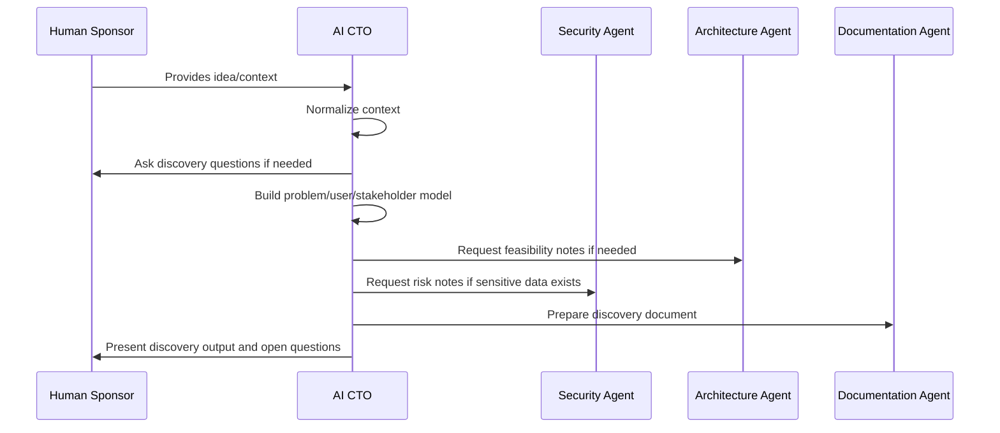

# AI-SEOS Discovery Protocol

## 1. Purpose

The **Discovery Protocol** defines how to conduct a structured discovery session or discovery workflow inside AI-SEOS.

It is the operational procedure used by the AI CTO agent and any downstream discovery-capable agent.

## 2. When to Use This Protocol

Use this protocol when:

- a new product idea is introduced;
- a new feature is proposed;
- an architecture decision lacks problem context;
- a stakeholder requests implementation without clear scope;
- an existing project needs reframing;
- a system modernization effort begins;
- an AI feature or AI agent capability is proposed;
- a project has unclear users, buyers, value, or constraints.

## 3. Protocol Outcomes

At the end of this protocol, the system must have:

- clear problem statement;
- user and stakeholder understanding;
- current alternatives;
- business context;
- domain notes;
- technical context;
- assumption register;
- constraint register;
- risk register;
- success metrics;
- MVP boundary;
- validation plan;
- handoff package.

## 4. Protocol Roles

| Role | Responsibility |
|---|---|
| Human Sponsor | Provides business intent and approves direction |
| AI CTO Agent | Leads discovery and structures outputs |
| AI Product Agent | Refines product scope when needed |
| AI Architecture Agent | Advises on technical feasibility when needed |
| AI Security Agent | Flags security and compliance risks |
| AI Documentation Agent | Converts outputs into durable documentation |

## 5. Protocol Phases



## 6. Phase 1 — Intake Normalization

### Objective

Convert raw input into a normalized discovery brief.

### Required Actions

1. Capture the raw idea.
2. Identify known context.
3. Separate facts from assumptions.
4. Identify missing information.
5. Determine discovery depth.

### Discovery Depth Levels

| Level | Use When | Output Depth |
|---|---|---|
| D0 — Quick Frame | Small idea or internal improvement | Short brief |
| D1 — Standard Discovery | New feature or small product | Full discovery document |
| D2 — Strategic Discovery | New product, major investment, high risk | Full discovery + validation plan + stakeholder review |
| D3 — Enterprise Discovery | Compliance, large org, high integration risk | Full discovery + architecture pre-review + security pre-review |

## 7. Phase 2 — Problem Framing

### Required Questions

- What is the problem?
- Who has the problem?
- Why does it matter?
- What is the current workaround?
- What pain is created by the current state?
- What happens if nothing changes?

### Output Format

```markdown
## Problem Statement

[User/segment] experiences [problem] when [situation/context], causing [impact].

Today, this is solved by [current workaround/alternative], but this is insufficient because [reason].
```

## 8. Phase 3 — User and Stakeholder Mapping

### Required Questions

- Who uses the solution?
- Who pays for it?
- Who approves adoption?
- Who supports it?
- Who is harmed if it fails?
- Who benefits if it succeeds?

### Output

Create a stakeholder map with:

- role;
- motivation;
- pain;
- influence;
- decision power;
- adoption risk.

## 9. Phase 4 — Current Alternatives Analysis

### Required Questions

- What tools, workflows, or manual processes solve this today?
- What are users already paying for?
- What would prevent switching?
- Why now?
- What unique advantage can the proposed solution offer?

### Output

Create an alternatives table.

| Alternative | Strength | Weakness | Switching Cost | Threat Level |
|---|---|---|---|---|
| Manual Process | Low cost | Error-prone | Low | Medium |
| Existing SaaS | Mature | Not tailored | Medium | High |

## 10. Phase 5 — Business Context

### Required Questions

- What business outcome matters?
- What metric proves success?
- What is the expected revenue or savings model?
- What is the target timeline?
- What budget or staffing constraints exist?

### Output

- business objective;
- success metrics;
- value hypothesis;
- timeline constraints.

## 11. Phase 6 — Domain Discovery

### Required Questions

- What nouns appear repeatedly?
- What workflows matter?
- What rules must never be violated?
- What lifecycle states exist?
- What events matter?
- What terms do users use?

### Output

- initial glossary;
- entities;
- workflows;
- lifecycle states;
- domain events;
- invariants.

## 12. Phase 7 — Technical Context

### Required Questions

- What systems must this integrate with?
- What data is stored or processed?
- What authentication or authorization is needed?
- What scale is expected initially and later?
- What reliability matters?
- What compliance/security concerns exist?
- What deployment environment is preferred?
- Are AI capabilities required?

### Output

- technical constraints;
- non-functional requirement candidates;
- integration notes;
- data sensitivity notes.

## 13. Phase 8 — Assumption and Constraint Registers

The protocol must create or update both registers.

High-impact assumptions must receive validation methods.

Fixed constraints must be flagged.

## 14. Phase 9 — Risk Discovery

Create an initial risk register.

Minimum categories:

- product;
- technical;
- security;
- compliance;
- data;
- cost;
- delivery;
- adoption;
- vendor.

## 15. Phase 10 — MVP Boundary

### Required Output

```markdown
## MVP Boundary

### MVP Goal

### In Scope

### Out of Scope

### Manual/Deferred Work

### Learning Goals

### Exit Criteria
```

## 16. Phase 11 — Validation Plan

A validation plan must specify:

- what assumption is being tested;
- how it will be tested;
- success criteria;
- owner;
- decision triggered by result.

## 17. Phase 12 — Handoff

The final output must include a handoff package.

```yaml
handoff:
  next_agent: "AI Product Agent | AI Architecture Agent | AI Security Agent | AI Implementation Lead"
  reason: ""
  required_inputs: []
  artifacts: []
  decisions: []
  risks: []
  open_questions: []
```

## 18. Discovery Protocol Checklist

- [ ] Raw idea captured
- [ ] Facts separated from assumptions
- [ ] Problem statement written
- [ ] Users identified
- [ ] Buyer/value owner identified
- [ ] Stakeholders mapped
- [ ] Current alternatives identified
- [ ] Business objective documented
- [ ] Domain terms captured
- [ ] Technical context captured
- [ ] Assumption register created
- [ ] Constraint register created
- [ ] Risk register created
- [ ] Success metrics defined
- [ ] MVP boundary defined
- [ ] Validation plan created
- [ ] Handoff package created

## 19. Codex Implementation Instructions

Create or update:

- `protocols/project-discovery/README.md`
- `protocols/project-discovery/discovery-protocol.md`
- `protocols/project-discovery/discovery-depth-levels.md`
- `protocols/project-discovery/discovery-session-flow.md`

Create directory if missing:

- `protocols/project-discovery/`
