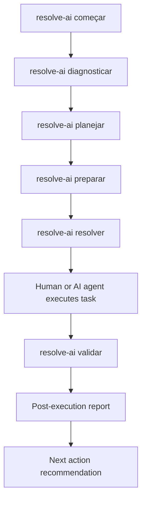

# pt171 — Phase 9 — Resolve Aí Guided Review and Validation Rationale

## Status
Draft for implementation by Codex

## Phase
Phase 9 — Resolve Aí Guided Review and Validation

## Objective
Implement the first post-execution validation layer of the Resolve Aí CLI through the command:

```bash
resolve-ai validar
```

This phase closes the first practical runtime loop:

```text
começar → diagnosticar → planejar → preparar → resolver → validar
```

The command `resolver` prepares an assisted execution package. The command `validar` reviews what happened after the human or agent executed the prepared task.

## Why this phase exists
Until Phase 8, Resolve Aí can prepare a task and generate the final implementation prompt. However, after an external agent or human changes the project, the framework still needs a safe way to answer:

- What changed?
- Did the work match the prepared task?
- What risks remain?
- What should be tested manually?
- Is the task ready to be committed?
- What should the next agent know?

Without this phase, Resolve Aí would stop at preparation and leave validation to the user. That would weaken the central promise of the project:

> Me dá o problema ou a ideia, e eu te ajudo a resolver.

To help solve responsibly, Resolve Aí must also help review.

## What `validar` is
`resolve-ai validar` is a guided validation command.

It reads the Resolve Aí local state, previous docs, execution package and, when available, local Git metadata. It then generates a post-execution validation package in `docs/resolve-ai/`.

## What `validar` is not
`validar` is not an automated QA runner.

It must not:

- modify product code;
- install dependencies;
- run destructive commands;
- commit automatically;
- deploy automatically;
- push automatically;
- call external APIs;
- hide uncertainty;
- declare production readiness without evidence.

## Position in the Resolve Aí runtime



## Core behavior
The command should:

1. Check whether Resolve Aí is active.
2. Read `.resolve-ai/state.json`.
3. Detect whether a previous assisted execution exists.
4. Inspect safe local project metadata.
5. Detect changed files when Git is available.
6. Compare changes with the previous prepared task at a high level.
7. Generate validation docs 25 to 29.
8. Update status with validation summary.
9. Recommend next action.

## Required output documents

```text
docs/resolve-ai/25-relatorio-de-validacao.md
docs/resolve-ai/26-mudancas-detectadas.md
docs/resolve-ai/27-checklist-pos-execucao.md
docs/resolve-ai/28-riscos-pos-execucao.md
docs/resolve-ai/29-handoff-pos-validacao.md
```

## Safety posture
The validation command must be conservative.

If there is not enough evidence, it should say:

```text
Não consegui validar completamente.
```

Not:

```text
Tudo certo.
```

Resolve Aí should prefer honest uncertainty over false confidence.

## Phase success criteria
Phase 9 is successful when:

- `resolve-ai validar` exists;
- aliases exist;
- docs 25 to 29 are generated without overwriting by default;
- local Git change detection works when available;
- no product code is modified;
- no tests are executed automatically unless explicitly deferred to a future phase;
- status includes last validation;
- test coverage grows without breaking previous phases.
