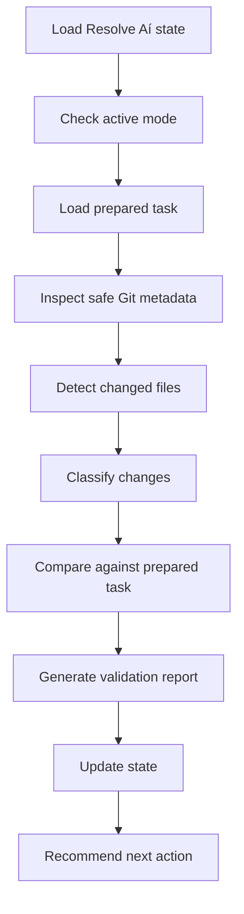

# pt173 — Post-Execution Review Model

## Objective
Define how Resolve Aí reviews a project after a human or AI agent executes a prepared task.

## Review philosophy
Resolve Aí should validate by evidence, not by optimism.

It must separate:

```text
What was planned
What was prepared
What seems to have changed
What can be validated locally
What still needs human/manual validation
```

## Review inputs

### 1. Prepared task
From:

```text
docs/resolve-ai/15-tarefa-preparada.md
```

### 2. Implementation prompt
From:

```text
docs/resolve-ai/16-prompt-de-implementacao.md
docs/resolve-ai/22-prompt-final-para-agente.md
```

### 3. Risk documents
From:

```text
docs/resolve-ai/18-riscos-da-execucao.md
docs/resolve-ai/28-riscos-pos-execucao.md
```

### 4. Post-execution checklist
From:

```text
docs/resolve-ai/23-checklist-pos-execucao.md
```

### 5. Local metadata
From:

```text
Git status
Git diff file names
Git diff stats
Project structure
Resolve Aí state
```

## Review pipeline



## Change categories
The CLI should classify changed files by path patterns.

### Documentation changes
Examples:

```text
README.md
docs/**
*.md
```

### Source changes
Examples:

```text
src/**
app/**
pages/**
components/**
lib/**
services/**
functions/**
```

### Config changes
Examples:

```text
package.json
tsconfig.json
vite.config.*
next.config.*
.env.example
```

### Test changes
Examples:

```text
*.test.*
*.spec.*
tests/**
__tests__/**
```

### Risk-sensitive changes
Examples:

```text
.env
*.pem
*.key
secrets/**
backups/**
*.csv
*_auth_users.json
```

## Alignment model
The validation should mark change alignment as:

```text
alinhado
parcialmente-alinhado
não-verificado
potencialmente-fora-do-escopo
```

## Confidence model

```text
Alta: prepared task exists, changes detected, no risk-sensitive files, docs align.
Média: prepared task exists, changes detected, but validation is mostly path-based.
Baixa: no prepared task or no Git metadata.
Bloqueada: sensitive files or critical risks detected.
```

## Output tone
Use plain language.

Instead of:

```text
The execution artifact is non-deterministically unverifiable.
```

Use:

```text
Não tenho evidência suficiente para dizer que a tarefa foi concluída com segurança.
```
