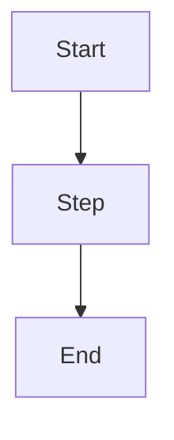

# Discovery Document Template

> Use this template to transform a raw idea into a structured discovery artifact ready for product, architecture, security, and implementation planning.

## Metadata

```yaml
project_name: ""
document_type: "Discovery Document"
version: "0.1.0"
status: "draft | review | accepted"
owner: ""
created_at: "YYYY-MM-DD"
last_updated: "YYYY-MM-DD"
discovery_depth: "D0 | D1 | D2 | D3"
source_request: ""
```

# 1. Executive Summary

## 1.1 Short Summary

Describe the initiative in 3–5 sentences.

## 1.2 Decision Needed

What decision should this discovery support?

Examples:

- proceed to product definition;
- proceed to architecture exploration;
- run validation first;
- stop or defer initiative;
- perform technical spike.

## 1.3 Recommended Next Step

State the recommended next agent or workflow.

# 2. Raw Idea

## 2.1 Original Idea

Paste the original idea as received.

## 2.2 Interpreted Idea

Rewrite the idea in structured form.

## 2.3 Initial Unknowns

List what is not yet known.

# 3. Problem Statement

## 3.1 Problem Statement

Use this format:

```text
[User/segment] experiences [problem] when [situation/context], causing [impact].
Today, this is solved by [current workaround/alternative], but this is insufficient because [reason].
```

## 3.2 Pain Evidence

Document available evidence.

| Evidence | Source | Confidence | Notes |
|---|---|---|---|
|  |  | Low/Medium/High |  |

## 3.3 Problem Severity

| Dimension | Assessment | Notes |
|---|---|---|
| Frequency |  |  |
| Impact |  |  |
| Urgency |  |  |
| Cost of Inaction |  |  |

# 4. Users and Stakeholders

## 4.1 User Segments

| Segment | Description | Primary Pain | Usage Context | Priority |
|---|---|---|---|---|
|  |  |  |  |  |

## 4.2 Personas

### Persona 1

- Name:
- Role:
- Context:
- Goals:
- Pain points:
- Current tools:
- Adoption barriers:
- Success definition:

## 4.3 Stakeholder Map

| Stakeholder | Role | Motivation | Influence | Decision Power | Risk |
|---|---|---|---|---|---|
|  |  |  | Low/Medium/High | Low/Medium/High |  |

## 4.4 Buyer vs User

- User:
- Buyer:
- Approver:
- Operator:
- Support owner:

# 5. Current Alternatives

## 5.1 Current Workflow

Describe how the problem is solved today.

## 5.2 Alternatives Table

| Alternative | Type | Strengths | Weaknesses | Switching Cost | Threat Level |
|---|---|---|---|---|---|
|  | Manual/SaaS/Internal/Competitor |  |  | Low/Medium/High | Low/Medium/High |

## 5.3 Differentiation Hypothesis

What could make the proposed solution meaningfully better?

# 6. Business Context

## 6.1 Business Objective

State the business objective.

## 6.2 Value Hypothesis

```text
If we build [solution], then [target user/customer] will achieve [outcome], because [reason].
```

## 6.3 Business Model

- Revenue model:
- Cost saving model:
- Strategic value:
- Adoption path:

## 6.4 Success Metrics

| Metric | Type | Baseline | Target | Measurement Method |
|---|---|---|---|---|
|  | Leading/Lagging/Quality/Operational |  |  |  |

# 7. Domain Discovery

## 7.1 Glossary

| Term | Definition | Notes |
|---|---|---|
|  |  |  |

## 7.2 Entities

| Entity | Description | Key Attributes | Lifecycle |
|---|---|---|---|
|  |  |  |  |

## 7.3 Workflows



## 7.4 Domain Events

| Event | Trigger | Producer | Consumer | Notes |
|---|---|---|---|---|
|  |  |  |  |  |

## 7.5 Invariants

Rules that must always be true.

- 

# 8. Technical Context

## 8.1 Existing Systems

| System | Purpose | Integration Needed | Owner | Risk |
|---|---|---|---|---|
|  |  |  |  |  |

## 8.2 Data Considerations

| Data Type | Sensitivity | Storage Needed | Retention | Compliance Notes |
|---|---|---|---|---|
|  | Low/Medium/High/Critical | Yes/No |  |  |

## 8.3 Non-Functional Requirement Candidates

| Category | Requirement | Priority | Notes |
|---|---|---|---|
| Performance |  | Must/Should/Could |  |
| Availability |  | Must/Should/Could |  |
| Security |  | Must/Should/Could |  |
| Scalability |  | Must/Should/Could |  |
| Observability |  | Must/Should/Could |  |

# 9. Assumption Register

| ID | Assumption | Category | Confidence | Impact If Wrong | Validation Method | Status |
|---|---|---|---|---|---|---|
| ASM-001 |  | Product/Technical/Business/Security | Low/Medium/High | Low/Medium/High/Critical |  | Open |

# 10. Constraint Register

| ID | Constraint | Category | Flexibility | Impact | Affected Decisions |
|---|---|---|---|---|---|
| CON-001 |  | Time/Budget/Team/Tech/Compliance | Fixed/Negotiable/Unknown | Low/Medium/High |  |

# 11. Risk Register

| ID | Risk | Category | Probability | Impact | Mitigation | Owner | Status |
|---|---|---|---|---|---|---|---|
| RSK-001 |  | Product/Technical/Security/Cost/Delivery | Low/Medium/High | Low/Medium/High/Critical |  |  | Open |

# 12. MVP Boundary

## 12.1 MVP Goal

## 12.2 In Scope

- 

## 12.3 Out of Scope

- 

## 12.4 Manual or Deferred Work

| Item | Reason | Revisit Trigger |
|---|---|---|
|  |  |  |

## 12.5 Learning Goals

- 

## 12.6 MVP Exit Criteria

- 

# 13. Validation Plan

| Assumption/Risk | Validation Method | Success Criteria | Owner | Deadline | Decision Trigger |
|---|---|---|---|---|---|
|  | Interview/Prototype/Spike/Data analysis |  |  |  |  |

# 14. Open Questions

| ID | Question | Owner | Priority | Needed Before |
|---|---|---|---|---|
| Q-001 |  |  | Low/Medium/High |  |

# 15. Recommended Handoff

## 15.1 Next Agent

- [ ] AI Product Agent
- [ ] AI Architecture Agent
- [ ] AI Security Agent
- [ ] AI Implementation Lead
- [ ] AI QA Lead
- [ ] AI Documentation Agent

## 15.2 Handoff Reason

## 15.3 Handoff Package

```yaml
handoff:
  summary: ""
  artifacts:
    - ""
  decisions:
    - ""
  assumptions:
    - ""
  risks:
    - ""
  open_questions:
    - ""
  next_actions:
    - ""
```

# 16. Discovery Definition of Done

- [ ] Problem is explicit
- [ ] Users are identified
- [ ] Buyer/value owner is identified
- [ ] Stakeholders are mapped
- [ ] Current alternatives are documented
- [ ] Business objective is documented
- [ ] Domain terms are captured
- [ ] Technical context is documented
- [ ] Assumptions are registered
- [ ] Constraints are registered
- [ ] Risks are registered
- [ ] Success metrics are defined
- [ ] MVP boundary is defined
- [ ] Validation plan exists
- [ ] Handoff package is actionable

## Codex Implementation Instructions

Create or update:

- `templates/discovery/README.md`
- `templates/discovery/discovery-document-template.md`
- `templates/discovery/assumption-register-template.md`
- `templates/discovery/constraint-register-template.md`
- `templates/discovery/risk-register-template.md`
- `templates/discovery/mvp-boundary-template.md`
- `templates/discovery/handoff-template.md`

Create directory if missing:

- `templates/discovery/`
