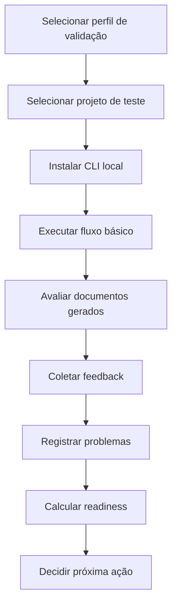

# Alpha Validation Protocol

## Objective

Define the official protocol for validating Resolve Aí with real or representative users before public distribution.

## Core validation question

> Does Resolve Aí help users understand, organize and continue a software project without requiring them to understand the full internal framework?

## Protocol stages



## Mandatory validation flow

Each validation participant or scenario must run:

```bash
resolve-ai ajuda
resolve-ai começar
resolve-ai ligar
resolve-ai diagnosticar
resolve-ai planejar
resolve-ai preparar
resolve-ai resolver
resolve-ai validar
resolve-ai status
```

The validator must observe:

- whether command names are intuitive;
- whether outputs are understandable;
- whether `docs/resolve-ai/` is created correctly;
- whether existing files are preserved;
- whether the user understands the recommended next step;
- whether safety boundaries are clear.

## Project categories

Validate at least:

1. **Empty/new project** — no meaningful files yet.
2. **Small Node/React project** — common vibe coder scenario.
3. **Existing in-progress product** — real project with code and partial docs.
4. **Messy/legacy project** — unclear structure, missing docs, possible risks.
5. **Professional repo** — mature structure, package scripts, README, tests.

## Required artifacts

For every validation scenario, create:

```text
docs/alpha-validation/<scenario-id>/
  00-scenario.md
  01-setup.md
  02-command-run-log.md
  03-generated-docs-review.md
  04-user-feedback.md
  05-issues-found.md
  06-readiness-score.md
  07-recommendation.md
```

## Validation rules

- Do not use sensitive real data in examples.
- Do not commit generated docs from private projects unless anonymized.
- Do not publish user feedback without consent.
- Do not overstate readiness.
- Prefer honest blockers over optimistic release claims.

## Pass criteria

Phase 11 passes when:

- at least three profile validations are documented;
- at least three project type validations are documented;
- feedback is triaged;
- readiness score is calculated;
- release recommendation is documented;
- known limitations are updated.

