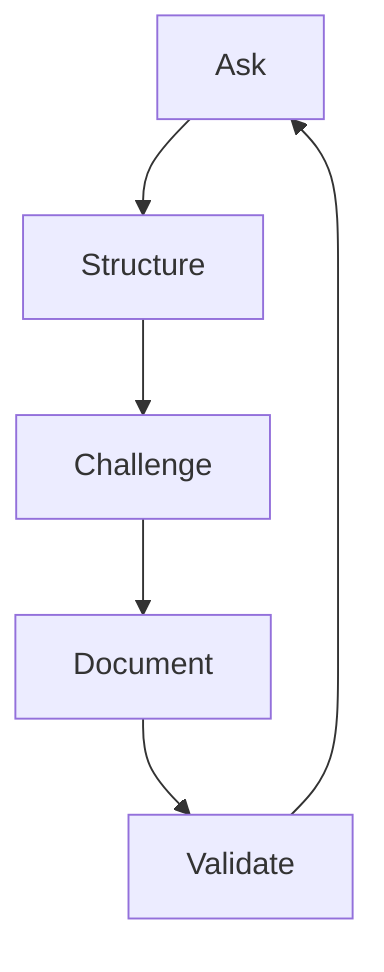

# AI-SEOS Project Discovery Playbook

## 1. Purpose

This playbook explains how to run project discovery using AI-SEOS.

It translates the Discovery Engine and Discovery Protocol into practical execution steps for humans, AI agents, and repository maintainers.

## 2. When to Use

Use this playbook when starting:

- a new SaaS product;
- a new internal tool;
- a major feature;
- an AI-powered capability;
- a legacy modernization;
- a platform migration;
- an architecture initiative;
- a technical discovery engagement.

## 3. Playbook Outcomes

After running this playbook, the team should have:

- a shared understanding of the problem;
- a documented user and stakeholder model;
- a clear MVP boundary;
- visible assumptions and constraints;
- initial risks;
- success metrics;
- validation plan;
- downstream handoff package.

## 4. Required Inputs

Minimum:

```yaml
idea: ""
requester: ""
known_context: ""
expected_outcome: ""
```

Preferred:

```yaml
project_name: ""
problem: ""
target_users: []
buyer: ""
constraints: []
success_metrics: []
existing_tools: []
known_risks: []
```

## 5. Discovery Facilitation Model

The AI CTO agent facilitates discovery using three loops.



### 5.1 Ask

Ask targeted questions.

### 5.2 Structure

Convert answers into artifacts.

### 5.3 Challenge

Find gaps, assumptions, contradictions, and scope creep.

### 5.4 Document

Persist the result.

### 5.5 Validate

Confirm readiness for the next stage.

## 6. Step-by-Step Playbook

### Step 1 — Prepare Discovery Workspace

Create or confirm folders:

- `docs/discovery/`
- `templates/discovery/`
- `protocols/project-discovery/`
- `playbooks/project-discovery/`

Create working files:

- discovery document;
- assumption register;
- constraint register;
- risk register;
- open questions list.

### Step 2 — Capture Raw Idea

Do not improve the idea yet.

Record it exactly.

Then create an interpreted version.

### Step 3 — Define Discovery Depth

Choose D0, D1, D2, or D3.

| Depth | Use When | Example |
|---|---|---|
| D0 | Low-risk, small improvement | Add export button |
| D1 | Standard feature/product | New SaaS MVP |
| D2 | Strategic initiative | New platform product |
| D3 | Enterprise/high-risk | Regulated fintech platform |

### Step 4 — Frame the Problem

Use the problem statement formula:

```text
[User/segment] experiences [problem] when [situation/context], causing [impact].
Today, this is solved by [current workaround/alternative], but this is insufficient because [reason].
```

Challenge the statement:

- Is it a problem or a solution?
- Is the user specific?
- Is the pain concrete?
- Is impact visible?
- Is current behavior understood?

### Step 5 — Map Users and Stakeholders

Separate:

- user;
- buyer;
- approver;
- operator;
- support owner;
- affected third party.

This prevents building for the wrong person.

### Step 6 — Understand Current Alternatives

For each alternative, document:

- what it is;
- why users choose it;
- why it is insufficient;
- switching cost;
- threat level.

### Step 7 — Capture Business Context

Write:

- business objective;
- value hypothesis;
- success metrics;
- constraints;
- adoption expectations.

### Step 8 — Discover Domain

Create early domain notes:

- glossary;
- entities;
- workflows;
- lifecycle states;
- events;
- invariants.

Avoid detailed database design at this stage.

### Step 9 — Capture Technical Context

Document:

- integrations;
- data types;
- auth needs;
- scale assumptions;
- reliability expectations;
- compliance concerns;
- AI requirements.

Do not finalize architecture yet.

### Step 10 — Build Registers

Create:

- assumption register;
- constraint register;
- risk register.

Sort assumptions by impact if wrong.

### Step 11 — Define MVP Boundary

Create three lists:

1. **Must be included**
2. **Explicitly excluded**
3. **Can be manual or deferred**

Then define learning goals.

### Step 12 — Create Validation Plan

For each critical assumption:

- validation method;
- success criteria;
- owner;
- deadline;
- decision trigger.

### Step 13 — Prepare Handoff

Select next agent:

- Product Agent if scope needs refinement;
- Architecture Agent if technical direction is next;
- Security Agent if sensitive data/compliance risk exists;
- Implementation Lead if scope and architecture are ready;
- QA Agent if acceptance strategy is needed.

## 7. Example Discovery Flow — SaaS MVP

### Raw Idea

"Create a SaaS for small academies to manage students, payments, and attendance."

### Problem Statement

Small academy owners manage students, payments, and attendance across notebooks, spreadsheets, and messaging apps, causing lost revenue, inconsistent follow-up, and poor operational visibility.

Today this is solved manually, but the process is error-prone, fragmented, and hard to scale.

### MVP Boundary

In scope:

- student registration;
- attendance tracking;
- payment status;
- basic dashboard;
- admin login.

Out of scope:

- full accounting;
- payroll;
- advanced CRM automation;
- native mobile app;
- multi-branch enterprise management.

Manual/deferred:

- advanced reporting;
- marketing automation;
- predictive churn model.

### Critical Assumptions

| Assumption | Impact If Wrong | Validation |
|---|---|---|
| Academy owners will use a web app weekly | High | Interviews + prototype test |
| Payment tracking is a top pain | High | Interview evidence |
| QR attendance is operationally viable | Medium | Pilot test |

## 8. Facilitator Questions

### Problem

- What problem are we solving?
- Who feels this problem most intensely?
- What breaks today?
- What is the cost of doing nothing?

### User

- Who uses the product daily?
- Who decides to adopt it?
- Who pays?
- Who complains if it fails?

### Value

- What outcome creates value?
- How will success be measured?
- What is the fastest path to learning?

### Scope

- What is the smallest useful product?
- What can be manual?
- What can be delayed?
- What should explicitly not be built?

### Risk

- What assumption could kill the project?
- What technical risk is unknown?
- What security issue could block launch?
- What cost could grow unexpectedly?

## 9. Playbook Anti-Patterns

- Running discovery as a casual brainstorming session.
- Treating assumptions as facts.
- Defining MVP as "everything needed for launch."
- Asking users what features they want instead of studying workflow pain.
- Choosing tech stack during problem discovery.
- Ignoring buyers and approvers.
- Ending discovery without handoff.

## 10. Playbook Definition of Done

The playbook is complete when:

- discovery document exists;
- assumptions are registered;
- constraints are registered;
- risks are registered;
- MVP is bounded;
- validation plan exists;
- handoff package exists;
- next agent is identified.

## 11. Codex Implementation Instructions

Create or update:

- `playbooks/project-discovery/README.md`
- `playbooks/project-discovery/project-discovery-playbook.md`
- `playbooks/project-discovery/saas-discovery-example.md`
- `playbooks/project-discovery/ai-feature-discovery-example.md`

Create directory if missing:

- `playbooks/project-discovery/`
