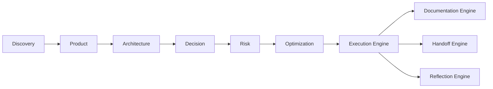
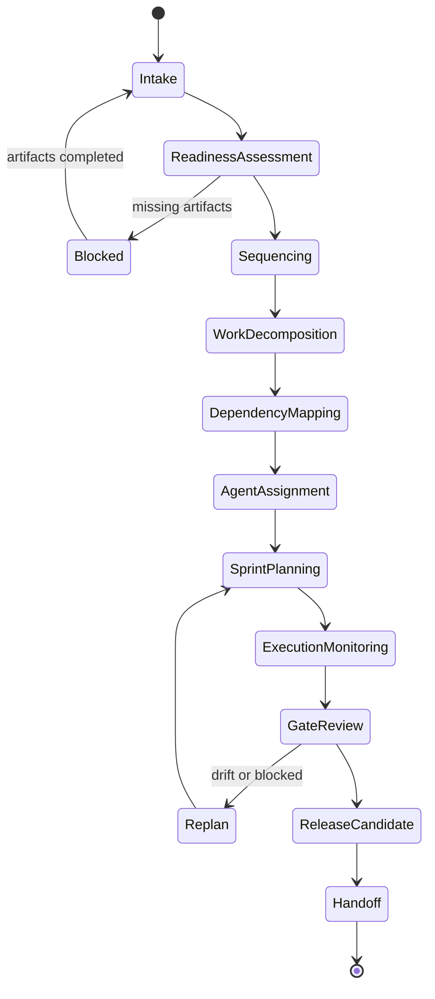

# Execution Engine

## 1. Purpose

The Execution Engine is the AI-SEOS operating engine responsible for transforming approved product, architecture, decision, risk and optimization artifacts into an executable delivery system.

It exists to prevent a common failure mode in AI-assisted software engineering: generating impressive planning documents that never become a controlled implementation path.

The Execution Engine converts strategy into sequence, scope into increments, architecture into implementation tracks, risk into guardrails, and decisions into concrete work packages.

In AI-SEOS, execution is not merely task generation. Execution is an engineered transition from reasoning to delivery.

## 2. Mission

The mission of the Execution Engine is to create a reliable delivery model that allows human teams and AI agents to implement software systems without losing context, violating architecture, ignoring risk, or silently expanding scope.

The engine must answer:

- What should be built first?
- What should not be built yet?
- Which dependencies block implementation?
- Which decisions must be resolved before coding?
- Which risks require mitigation before execution?
- Which tasks belong to which agent or role?
- What quality gates must be passed before moving forward?
- How will implementation progress be tracked?
- How will work be handed off between agents?
- How will scope drift be detected?

## 3. Scope

The Execution Engine governs:

- implementation planning;
- milestone design;
- sprint planning;
- sequencing of epics, features and technical work;
- dependency mapping;
- readiness assessment;
- work package generation;
- execution risk mitigation;
- agent assignment;
- implementation gates;
- delivery tracking;
- release candidate preparation;
- execution handoff;
- implementation feedback loops.

## 4. Non-scope

The Execution Engine does not replace:

- product discovery;
- architecture design;
- security review;
- QA execution;
- incident response;
- engineering judgment;
- human approval for high-impact decisions.

It may generate tasks and plans, but it does not automatically approve unsafe or unclear implementation.

## 5. Execution philosophy

### 5.1 Execution is architecture under constraint

Implementation is where architecture meets time, budget, skill, uncertainty and existing systems.

The Execution Engine must preserve architecture while adapting delivery to constraints.

### 5.2 Work should be sliced by value and risk

AI-SEOS does not default to large technical phases that produce no usable value.

Work should be sliced to create validated increments while reducing the highest unknowns early.

### 5.3 Sequencing is a strategic decision

The order of implementation can make a project safer, faster and cheaper, or slower and more fragile.

Execution sequencing must consider:

- user value;
- architectural dependencies;
- technical risk;
- learning value;
- integration complexity;
- security exposure;
- reversibility;
- team capacity;
- operational readiness.

### 5.4 Plans are living artifacts

An execution plan is not a contract with certainty.

It is a control mechanism that must evolve when evidence changes.

### 5.5 AI-generated work requires explicit verification

AI agents can accelerate execution, but every generated work package must be testable, reviewable and traceable back to accepted artifacts.

## 6. Inputs

Mandatory inputs:

- Discovery Summary;
- Product Requirements Document;
- MVP Scope Definition;
- Product Roadmap;
- Architecture Overview;
- Domain Model;
- Integration Model;
- Decision Matrix;
- ADRs;
- Risk Register;
- Optimization Review;
- Context Package.

Optional inputs:

- existing codebase analysis;
- repository structure;
- CI/CD constraints;
- team capacity;
- release calendar;
- stakeholder deadlines;
- cost model;
- compliance checklist;
- external dependency contracts.

## 7. Outputs

The Execution Engine produces:

- Execution Plan;
- Milestone Plan;
- Sprint Plan;
- Delivery Roadmap;
- Work Breakdown Structure;
- Technical Backlog;
- Dependency Map;
- Implementation Readiness Report;
- Agent Assignment Matrix;
- Execution Risk Register;
- Release Candidate Checklist;
- Handoff Package for implementation agents;
- Execution Validation Report.

## 8. Execution lifecycle

## 9. Execution object model

The Execution Engine must create and maintain the following objects.

### 9.1 Initiative

A strategic delivery unit connected to a product or architecture objective.

Attributes:

- ID;
- name;
- objective;
- business outcome;
- technical outcome;
- owner;
- related PRD;
- related ADRs;
- related risks;
- target milestone;
- status.

### 9.2 Milestone

A meaningful delivery checkpoint that produces an observable project state.

Attributes:

- ID;
- name;
- expected outcome;
- entry criteria;
- exit criteria;
- dependencies;
- risk level;
- quality gates;
- acceptance criteria;
- release implications.

### 9.3 Work Package

A coherent unit of implementation that can be assigned to an agent or human role.

Attributes:

- ID;
- title;
- type;
- scope;
- context;
- expected output;
- constraints;
- dependencies;
- tests required;
- documentation required;
- review required;
- assigned role;
- done criteria.

### 9.4 Execution Gate

A checkpoint that prevents unsafe progress.

Examples:

- Discovery Gate;
- Product Gate;
- Architecture Gate;
- Decision Gate;
- Risk Gate;
- Optimization Gate;
- Implementation Gate;
- QA Gate;
- Release Gate.

### 9.5 Execution Context Package

A packaged handoff containing all information required for an implementation agent to work without re-discovering the project.

It must include:

- problem context;
- product scope;
- architecture decisions;
- constraints;
- risks;
- work package;
- acceptance criteria;
- quality gates;
- references;
- open questions.

## 10. Work classification

All execution work must be classified.

| Type | Description | Examples |
|---|---|---|
| Product | User-facing capability | onboarding flow, billing page |
| Domain | Core business model work | aggregates, domain events |
| Architecture | Structural implementation | module boundaries, API contracts |
| Infrastructure | Delivery foundation | CI/CD, environments, secrets |
| Security | Protection and compliance | auth, audit logs, threat mitigation |
| Data | Persistence and migration | schema, indexes, migration plan |
| Integration | External systems | payment, email, analytics |
| Quality | Tests and verification | unit tests, E2E tests, contract tests |
| Documentation | Knowledge artifacts | README, runbook, architecture docs |
| Operational | Production readiness | monitoring, alerts, dashboards |

## 11. Sequencing heuristics

The Execution Engine should sequence work using the following order of preference:

1. unblock unknowns;
2. establish architectural skeleton;
3. create domain foundation;
4. implement thin vertical slices;
5. validate integrations early;
6. secure critical paths early;
7. automate repeated checks;
8. defer optional complexity;
9. document decisions as they become real;
10. prepare handoff and operation continuously.

## 12. Execution readiness levels

AI-SEOS defines Execution Readiness Levels (ERL).

| Level | Name | Meaning |
|---|---|---|
| ERL-0 | Not Ready | Missing core context or unresolved blocking decisions |
| ERL-1 | Partially Ready | Basic product and architecture context exists but gaps remain |
| ERL-2 | Ready for Planning | Execution can be planned but not yet started safely |
| ERL-3 | Ready for Implementation | Work packages, gates and dependencies are defined |
| ERL-4 | Ready for Release Candidate | Implementation completed with verification pending |
| ERL-5 | Ready for Operational Handoff | Release, docs and operations are prepared |

A project cannot move into implementation below ERL-3 unless explicitly documented as a controlled spike.

## 13. Quality gates

### 13.1 Intake Gate

Pass criteria:

- required upstream artifacts exist;
- project objective is clear;
- scope boundaries are known;
- current decisions are visible;
- critical risks are known.

### 13.2 Planning Gate

Pass criteria:

- milestones exist;
- work packages exist;
- dependencies are mapped;
- roles are assigned;
- acceptance criteria are defined.

### 13.3 Implementation Gate

Pass criteria:

- each work package has context;
- tests are defined;
- documentation needs are identified;
- risks have mitigations;
- architectural constraints are explicit.

### 13.4 Release Candidate Gate

Pass criteria:

- acceptance criteria met;
- required tests passed;
- documentation updated;
- security considerations reviewed;
- operations handoff prepared.

## 14. Failure modes

| Failure Mode | Description | Prevention |
|---|---|---|
| Planning theater | Beautiful plans with no executable units | Require work packages and gates |
| Scope drift | Extra features enter execution silently | Maintain MVP boundaries and change log |
| Architecture erosion | Implementation violates architecture | Link tasks to architecture constraints |
| Risk blindness | Known risks ignored during delivery | Bind risks to work packages |
| Agent fragmentation | Agents work with incomplete context | Use context packages |
| Premature coding | Code starts before readiness | Enforce ERL gates |
| Delivery opacity | No clear status or blockers | Maintain execution state model |
| Documentation lag | Docs created after memory is lost | Documentation Engine integration |

## 15. Integration with other engines

### Discovery Engine

Provides problem context, users, assumptions and constraints.

### Product Engine

Provides PRD, MVP, user stories, scope and roadmap.

### Architecture Engine

Provides system structure, domain model, views and constraints.

### Decision Engine

Provides approved decisions and decision confidence.

### Risk Engine

Provides risk register and mitigation priorities.

### Optimization Engine

Provides simplification, cost and scalability guidance.

### Documentation Engine

Receives execution outputs and keeps project knowledge current.

### Handoff Engine

Packages execution context for specialized agents.

### Reflection Engine

Reviews the execution process and detects systemic improvements.

## 16. Definition of Done

The Execution Engine is complete when:

- execution lifecycle is documented;
- execution object model is documented;
- execution readiness levels are defined;
- execution templates exist;
- planning protocol exists;
- milestone and sprint planning templates exist;
- implementation handoff format exists;
- quality gates are defined;
- failure modes are documented;
- ADR for Execution Engine is created;
- Sprint 4 validation confirms integration with previous engines.
