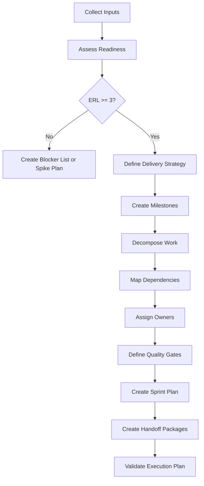
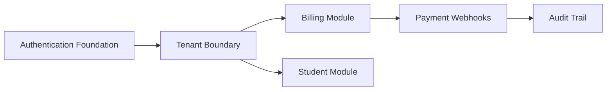

# Execution Planning and Delivery Protocol

## 1. Purpose

This protocol defines how AI-SEOS turns approved upstream artifacts into controlled implementation plans, sprint plans, work packages and release candidates.

It is the procedural layer of the Execution Engine.

Where the Execution Engine defines the operating model, this protocol defines the step-by-step behavior required from AI agents and human maintainers during planning and delivery.

## 2. Mandatory rule

No implementation agent may begin feature delivery until the Execution Planning Protocol has produced a valid Execution Plan or a formally documented Spike Plan.

A spike is allowed only when:

- the unknown is explicit;
- the expected learning is defined;
- the timebox is defined;
- the output artifact is defined;
- no production commitment is implied.

## 3. Roles

| Role | Responsibility |
|---|---|
| AI CTO | Approves execution strategy and validates alignment |
| Product Owner Agent | Validates product scope and acceptance criteria |
| Solution Architect Agent | Validates architecture constraints and dependencies |
| Principal Engineer Agent | Validates implementation feasibility |
| Security Agent | Validates security-sensitive work |
| QA Agent | Validates test strategy and acceptance gates |
| Documentation Agent | Ensures documentation tasks are included |
| Implementation Agent | Executes assigned work packages |
| Human Maintainer | Approves high-impact execution changes |

## 4. Planning protocol lifecycle

## 5. Step 1 — Collect inputs

The planning process must collect:

- current Context Package;
- Discovery Summary;
- PRD;
- MVP Definition;
- Product Roadmap;
- Architecture Overview;
- Domain Model;
- Integration Model;
- ADR index;
- Decision Matrix;
- Risk Register;
- Optimization Review;
- current repository structure;
- current implementation state;
- known constraints.

If an input is missing, the planner must classify it as:

- blocking;
- non-blocking but risky;
- optional;
- obsolete;
- superseded.

## 6. Step 2 — Assess execution readiness

Use ERL levels from the Execution Engine.

The readiness report must include:

- overall ERL;
- missing artifacts;
- unresolved decisions;
- unmanaged risks;
- unclear ownership;
- dependency gaps;
- documentation gaps;
- test strategy gaps;
- recommended next action.

## 7. Step 3 — Choose delivery strategy

The engine must choose one of the following delivery strategies.

| Strategy | Use When | Risk |
|---|---|---|
| Vertical Slice | Need early user validation | May require broad setup |
| Architecture Skeleton | Architecture risk is high | May delay visible user value |
| Integration First | External systems are critical | May expose vendor constraints early |
| Security First | Sensitive data or compliance exists | May slow feature throughput |
| Data Foundation First | Domain data is central | May over-model if discovery is weak |
| Prototype/Spike | Unknown is too high | Must not become production by accident |
| Migration First | Legacy constraints dominate | Requires rollback planning |

The chosen strategy must be documented with trade-offs.

## 8. Step 4 — Create milestones

A milestone must represent a validated state, not just a time period.

Bad milestone:

> Build backend.

Good milestone:

> Authentication, tenant model and baseline authorization are implemented, tested and documented, enabling safe development of tenant-scoped product features.

Each milestone must include:

- name;
- outcome;
- entry criteria;
- exit criteria;
- dependencies;
- risks;
- acceptance criteria;
- related ADRs;
- related templates;
- responsible agent.

## 9. Step 5 — Decompose work

Work must be decomposed into:

- initiatives;
- epics;
- features;
- technical enablers;
- tasks;
- tests;
- documentation work;
- operational work.

Every work item must trace to at least one of:

- product requirement;
- architecture requirement;
- ADR;
- risk mitigation;
- optimization recommendation;
- operational requirement.

## 10. Step 6 — Dependency mapping

Dependencies must be explicit.

Types:

- product dependency;
- architecture dependency;
- data dependency;
- infrastructure dependency;
- external service dependency;
- security dependency;
- documentation dependency;
- decision dependency;
- human approval dependency.

Use Mermaid when dependencies are non-trivial.

## 11. Step 7 — Assign owners

Every work package must have an owner role.

Avoid assigning ownership to "AI" generically.

Use specific agents:

- Implementation Lead Agent;
- Backend Agent;
- Frontend Agent;
- QA Agent;
- Security Agent;
- Documentation Agent;
- DevOps Agent;
- Reviewer Agent;
- Human Maintainer.

## 12. Step 8 — Define quality gates

Each work package must define:

- acceptance criteria;
- required tests;
- review type;
- documentation update;
- risk check;
- rollback or recovery consideration;
- completion evidence.

## 13. Step 9 — Create sprint plan

Sprint plans must include:

- sprint objective;
- sprint scope;
- out-of-scope items;
- work packages;
- dependencies;
- risks;
- quality gates;
- expected artifacts;
- validation criteria;
- handoff requirements.

## 14. Step 10 — Create implementation handoff packages

Each agent receives a package with:

- work package ID;
- objective;
- context;
- constraints;
- relevant files;
- relevant ADRs;
- expected output;
- tests;
- documentation updates;
- done criteria;
- escalation triggers.

## 15. Delivery control protocol

During execution, each iteration must track:

- completed work;
- blocked work;
- scope changes;
- decision changes;
- new risks;
- architectural deviations;
- documentation changes;
- test status;
- release readiness.

## 16. Change control

Any change that affects scope, architecture, security, cost, delivery date or public contracts must be classified.

| Change Type | Required Action |
|---|---|
| Minor implementation detail | Update task notes |
| Scope change | Update PRD/backlog and notify Product Engine |
| Architecture change | Run Architecture Decision Protocol |
| Risk change | Update Risk Register |
| Cost change | Run Optimization Review |
| Security change | Trigger Security Review |
| Release change | Update roadmap and changelog |

## 17. Release candidate protocol

A release candidate exists only when:

- all included work packages are complete;
- acceptance criteria are satisfied;
- tests are executed or explicitly waived;
- documentation is updated;
- known risks are documented;
- rollback considerations exist;
- handoff package is prepared;
- human approval is obtained when required.

## 18. Required artifacts

This protocol must produce:

- Execution Plan;
- Milestone Plan;
- Sprint Plan;
- Work Package list;
- Dependency Map;
- Execution Readiness Report;
- Release Candidate Checklist;
- Implementation Handoff Packages;
- Execution Validation Report.

## 19. Anti-patterns

- Creating tasks without upstream traceability.
- Starting coding before architecture constraints are known.
- Treating AI-generated code as complete without review.
- Ignoring documentation work during planning.
- Creating milestones based only on time.
- Accepting scope expansion without a change record.
- Creating work packages too large for review.
- Hiding uncertainty inside optimistic estimates.

## 20. Definition of Done

This protocol is complete when:

- execution planning protocol exists;
- delivery control protocol exists;
- release candidate protocol exists;
- readiness report template exists;
- work package template exists;
- milestone and sprint templates exist;
- handoff package format exists;
- ADR for execution planning protocol exists.
