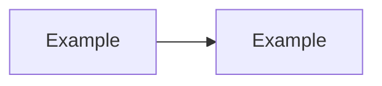

# Sprint, Milestone and Backlog Templates

## 1. Purpose

This file defines the canonical execution templates that must be materialized during Sprint 4.

These templates make the Execution Engine usable by AI agents and human teams.

They are intentionally structured, repetitive and explicit because execution quality depends on context clarity.

## 2. Template — Execution Plan

Create as `templates/execution/execution-plan-template.md`.

```markdown
---
title: <Project Name> Execution Plan
version: 0.1.0
status: Draft
owner: <Owner>
created: <YYYY-MM-DD>
source_artifacts:
  - Discovery Summary
  - PRD
  - Architecture Overview
  - ADR Index
  - Risk Register
  - Optimization Review
---

# <Project Name> Execution Plan

## 1. Executive Summary

<Describe how the project will move from planning to implementation.>

## 2. Execution Objective

<Define the objective of this execution cycle.>

## 3. Current Readiness

| Dimension | Level | Notes |
|---|---:|---|
| Discovery Readiness | DRL-<n> | |
| Product Readiness | PRL-<n> | |
| Architecture Readiness | ARL-<n> | |
| Decision Readiness | DEL-<n> | |
| Risk Readiness | RRL-<n> | |
| Optimization Readiness | ORL-<n> | |
| Execution Readiness | ERL-<n> | |

## 4. Scope

### 4.1 In Scope

- 

### 4.2 Out of Scope

- 

### 4.3 Deferred

- 

## 5. Delivery Strategy

Selected strategy: <Vertical Slice | Architecture Skeleton | Integration First | Security First | Data Foundation First | Spike | Migration First>

Reasoning:

Trade-offs:

## 6. Milestones

| Milestone | Outcome | Entry Criteria | Exit Criteria | Risk |
|---|---|---|---|---|
| M1 | | | | |

## 7. Work Breakdown

| Work Package | Type | Owner | Dependencies | Acceptance |
|---|---|---|---|---|
| WP-001 | | | | |

## 8. Dependency Map



## 9. Quality Gates

| Gate | Required Evidence | Status |
|---|---|---|
| Planning Gate | | Pending |
| Implementation Gate | | Pending |
| Release Candidate Gate | | Pending |

## 10. Risks and Mitigations

| Risk | Impact | Mitigation | Owner |
|---|---|---|---|
| | | | |

## 11. Documentation Requirements

- 

## 12. Release Candidate Criteria

- 

## 13. Open Questions

- 

## 14. Approval

| Role | Decision | Notes |
|---|---|---|
| AI CTO | Pending | |
| Human Maintainer | Pending | |
```

## 3. Template — Milestone Plan

Create as `templates/execution/milestone-plan-template.md`.

```markdown
---
title: <Milestone Name> Milestone Plan
version: 0.1.0
status: Draft
owner: <Owner>
---

# <Milestone Name> Milestone Plan

## 1. Milestone Outcome

<What observable state will exist after this milestone?>

## 2. Why This Milestone Exists

<Explain strategic, product, architecture or risk rationale.>

## 3. Entry Criteria

- 

## 4. Exit Criteria

- 

## 5. Work Packages

| ID | Title | Type | Owner | Status |
|---|---|---|---|---|
| WP-001 | | | | Pending |

## 6. Dependencies

| Dependency | Type | Owner | Status |
|---|---|---|---|
| | | | |

## 7. Risks

| Risk | Mitigation | Owner |
|---|---|---|
| | | |

## 8. Validation

| Criterion | Evidence | Status |
|---|---|---|
| | | |
```

## 4. Template — Sprint Plan

Create as `templates/execution/sprint-plan-template.md`.

```markdown
---
title: Sprint <N> Plan
version: 0.1.0
status: Draft
owner: <Owner>
---

# Sprint <N> Plan

## 1. Sprint Goal

<One clear outcome.>

## 2. Context

<What led to this sprint?>

## 3. In Scope

- 

## 4. Out of Scope

- 

## 5. Work Packages

| ID | Title | Owner | Acceptance Criteria | Status |
|---|---|---|---|---|
| WP-001 | | | | Pending |

## 6. Required Decisions

- ADR-<id>:

## 7. Required Tests

- 

## 8. Required Documentation Updates

- 

## 9. Risks

- 

## 10. Done Criteria

- [ ] All work packages completed
- [ ] Acceptance criteria passed
- [ ] Documentation updated
- [ ] Risks reviewed
- [ ] Handoff prepared
```

## 5. Template — Work Package

Create as `templates/execution/work-package-template.md`.

```markdown
---
id: WP-<ID>
title: <Work Package Title>
type: <Product | Domain | Architecture | Infrastructure | Security | Data | Integration | Quality | Documentation | Operational>
status: Draft
owner: <Agent or Role>
related_artifacts:
  - <PRD>
  - <ADR>
  - <Risk>
---

# WP-<ID> — <Work Package Title>

## 1. Objective

<What this package must accomplish.>

## 2. Context

<Enough context for an implementation agent to act safely.>

## 3. Scope

### In Scope

- 

### Out of Scope

- 

## 4. Constraints

- 

## 5. Inputs

- 

## 6. Expected Outputs

- 

## 7. Implementation Notes

- 

## 8. Acceptance Criteria

- [ ] 

## 9. Tests Required

- [ ] Unit
- [ ] Integration
- [ ] Contract
- [ ] E2E
- [ ] Manual validation

## 10. Documentation Required

- [ ] README update
- [ ] Architecture docs update
- [ ] Changelog update
- [ ] Runbook update

## 11. Risks

| Risk | Mitigation |
|---|---|
| | |

## 12. Done Evidence

<Links, commits, screenshots, test results or notes.>
```

## 6. Template — Execution Readiness Report

Create as `templates/execution/execution-readiness-report-template.md`.

```markdown
# Execution Readiness Report

## 1. Summary

Overall ERL: ERL-<n>

Recommendation: <Proceed | Proceed with constraints | Block | Spike first>

## 2. Readiness Matrix

| Dimension | Status | Evidence | Gap |
|---|---|---|---|
| Discovery | | | |
| Product | | | |
| Architecture | | | |
| Decision | | | |
| Risk | | | |
| Optimization | | | |
| Documentation | | | |
| Team/Agent | | | |

## 3. Blocking Issues

- 

## 4. Non-blocking Risks

- 

## 5. Required Actions

- 

## 6. Approval

| Role | Decision | Notes |
|---|---|---|
| AI CTO | | |
```

## 7. Template — Release Candidate Checklist

Create as `templates/execution/release-candidate-checklist.md`.

```markdown
# Release Candidate Checklist

## Scope

- [ ] Release scope is defined
- [ ] Out-of-scope items are documented
- [ ] Deferred items are tracked

## Product

- [ ] Acceptance criteria passed
- [ ] User journeys validated
- [ ] Product risks reviewed

## Architecture

- [ ] Architecture constraints respected
- [ ] Public contracts reviewed
- [ ] ADRs updated

## Security

- [ ] Sensitive flows reviewed
- [ ] Secrets not exposed
- [ ] Permissions validated
- [ ] Audit/logging requirements reviewed

## Quality

- [ ] Unit tests passed
- [ ] Integration tests passed
- [ ] E2E tests passed or waived
- [ ] Manual checks completed

## Documentation

- [ ] README updated
- [ ] Changelog updated
- [ ] Runbook updated if required
- [ ] Handoff package prepared

## Operations

- [ ] Deployment path known
- [ ] Rollback path known
- [ ] Monitoring considered
- [ ] Support notes prepared
```

## 8. Template — Technical Backlog

Create as `templates/backlog/technical-backlog-template.md`.

```markdown
# Technical Backlog

| ID | Item | Type | Source | Priority | Risk | Owner | Status |
|---|---|---|---|---|---|---|---|
| TB-001 | | | | | | | |

## Backlog Rules

- Every item must have a source artifact.
- Every high-risk item must link to the Risk Register.
- Every architecture-impacting item must link to an ADR or Architecture Decision Protocol output.
- Every implementation item must define acceptance criteria before execution.
```

## 9. Materialization requirements

During Sprint 4, Codex must:

- create `templates/execution/`;
- create `templates/backlog/` if missing;
- materialize each template as a separate file;
- update `templates/README.md`;
- link templates from Execution Engine documentation;
- include these templates in the Sprint 4 validation report.
