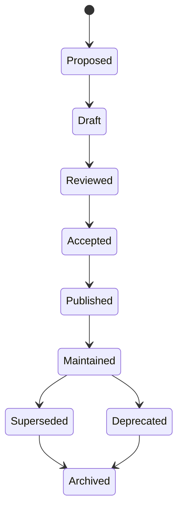

# Documentation Engine

## 1. Purpose

The Documentation Engine is the AI-SEOS operating engine responsible for ensuring that project knowledge is captured, structured, updated, reviewed and handed off as a first-class engineering artifact.

AI-SEOS treats documentation as infrastructure.

Documentation is not a final polishing step. It is a control surface for alignment, continuity, quality, onboarding, governance and safe AI collaboration.

## 2. Mission

The Documentation Engine ensures that every important project artifact remains:

- discoverable;
- current;
- traceable;
- useful;
- reviewable;
- versioned;
- linked to decisions;
- connected to execution;
- understandable by humans and AI agents.

## 3. Why this engine exists

AI-assisted projects can generate large volumes of content quickly. Without a Documentation Engine, that content becomes noise.

Common failures:

- multiple documents describe different realities;
- decisions are documented but not linked;
- templates exist but are not used;
- README files become outdated;
- agents act on stale instructions;
- implementation diverges from architecture docs;
- changelogs are forgotten;
- onboarding requires chat history;
- critical knowledge lives only in conversations.

The Documentation Engine exists to prevent knowledge decay.

## 4. Scope

The Documentation Engine governs:

- documentation architecture;
- document lifecycle;
- front matter standards;
- canonical artifact naming;
- index maintenance;
- cross-linking;
- changelog discipline;
- ADR integration;
- sprint reports;
- handoff documents;
- runbooks;
- templates;
- examples;
- versioning;
- documentation review gates.

## 5. Non-scope

It does not decide product strategy, architecture strategy or implementation approach.

It ensures those decisions are documented correctly.

## 6. Documentation lifecycle



## 7. Document states

| State | Meaning |
|---|---|
| Proposed | Document should exist but is not yet drafted |
| Draft | Initial content exists but is not stable |
| Reviewed | Reviewed for structure and consistency |
| Accepted | Approved as canonical for current version |
| Published | Available for use by agents and humans |
| Maintained | Actively updated as reality changes |
| Superseded | Replaced by newer artifact |
| Deprecated | Retained but no longer recommended |
| Archived | Historical only |

## 8. Documentation object model

### 8.1 Canonical Document

A canonical document is the authoritative source for a topic.

Attributes:

- title;
- canonical path;
- version;
- status;
- owner;
- last updated;
- related artifacts;
- dependencies;
- review cadence.

### 8.2 Index Document

A document that helps users and agents navigate a directory or domain.

Examples:

- README.md;
- adr/README.md;
- docs/sprints/README.md;
- frameworks/README.md.

### 8.3 Decision Document

An ADR, RFC or decision matrix output.

### 8.4 Operational Document

A protocol, runbook, checklist, handoff or execution plan.

### 8.5 Reference Document

A stable reference for principles, glossary, standards or architecture.

## 9. Documentation categories

| Category | Purpose | Examples |
|---|---|---|
| Orientation | Help people understand project | README, vision |
| Governance | Define rules and roles | GOVERNANCE, CONTRIBUTING |
| Architecture | Explain structure | architecture overview, C4 views |
| Operating System | Define engines | product engine, risk engine |
| Protocol | Define procedures | discovery protocol |
| Template | Provide reusable forms | ADR template |
| Playbook | Provide situational guidance | project discovery playbook |
| Report | Capture sprint or review result | validation report |
| Decision | Preserve rationale | ADR |
| Example | Demonstrate use | sample SaaS project |

## 10. Required front matter

Every canonical Markdown document should include:

```yaml
---
title: <Title>
version: <SemVer-like version>
status: <Draft | Active | Stable | Deprecated | Superseded>
owner: <Role or Team>
last_updated: <YYYY-MM-DD>
related_artifacts:
  - <optional>
---
```

Templates may include placeholder metadata.

## 11. Documentation quality principles

### 11.1 One concept, one canonical home

Avoid duplicate explanations across the repository.

Cross-link instead of copying.

### 11.2 Documentation must explain decisions, not only outcomes

A reader should understand why the project works the way it works.

### 11.3 Documentation must serve humans and agents

AI agents need structured, explicit, unambiguous instructions.

Humans need context, rationale and navigation.

### 11.4 Documentation must be executable when possible

Protocols, templates and checklists should guide action.

### 11.5 Documentation should age visibly

A stale document should be detectable from metadata, status, changelog and references.

## 12. Documentation quality gates

### 12.1 Structure Gate

Pass criteria:

- title exists;
- purpose exists;
- scope exists;
- status exists;
- owner exists if canonical;
- sections are coherent;
- headings follow hierarchy.

### 12.2 Traceability Gate

Pass criteria:

- related ADRs linked;
- source artifacts linked;
- dependencies identified;
- superseded docs marked.

### 12.3 Usefulness Gate

Pass criteria:

- document answers the reader's next question;
- examples exist when helpful;
- checklists exist when action is expected;
- vague statements are minimized.

### 12.4 Consistency Gate

Pass criteria:

- terminology matches glossary;
- file naming follows repository conventions;
- links are valid;
- duplicated content is avoided.

## 13. Documentation update triggers

Documentation must be updated when:

- an ADR is created or superseded;
- an engine is introduced or changed;
- a protocol changes;
- a template changes;
- sprint scope changes;
- architecture changes;
- risk status changes;
- release scope changes;
- onboarding instructions change;
- governance changes.

## 14. Documentation drift detection

Drift indicators:

- README mentions files that do not exist;
- ADR index is missing ADRs;
- roadmap and changelog disagree;
- templates reference old paths;
- protocols reference missing engines;
- sprint reports do not match created files;
- duplicated definitions conflict;
- agent instructions contradict engine rules.

## 15. Documentation review protocol

Every sprint should perform a documentation review:

1. list files created and updated;
2. validate indexes;
3. validate links where possible;
4. validate metadata;
5. validate ADR index;
6. validate changelog;
7. validate roadmap;
8. validate sprint report;
9. identify stale or duplicated content;
10. create remediation tasks.

## 16. Integration with other engines

### Execution Engine

Produces plans and work packages requiring documentation updates.

### Handoff Engine

Requires current documentation to package context.

### Reflection Engine

Identifies documentation patterns, gaps and improvements.

### Decision Engine

Requires ADRs and decision logs.

### Risk Engine

Requires risk register updates.

## 17. Anti-patterns

- Documentation after the fact.
- Copy-pasted explanations across directories.
- README files that become marketing pages only.
- Templates that are never linked from protocols.
- ADRs that are created but not indexed.
- Changelogs that list commits instead of meaningful changes.
- Sprint reports that only celebrate completion and do not record gaps.
- Agent instructions buried inside chat history.

## 18. Definition of Done

The Documentation Engine is complete when:

- engine document exists;
- lifecycle document exists;
- object model exists;
- quality gates exist;
- documentation maintenance protocol exists;
- information architecture standard exists;
- templates exist;
- ADR for Documentation Engine exists;
- Sprint 4 validation confirms integration with Execution, Handoff and Reflection.
