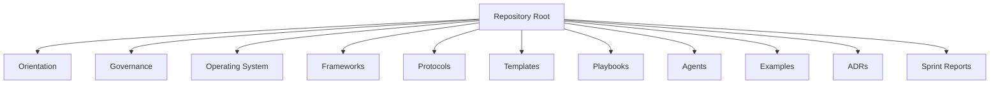

# Documentation Standards and Information Architecture

## 1. Purpose

This document defines the documentation standards AI-SEOS must use across all modules, engines, frameworks, protocols, templates, playbooks, agents and examples.

It provides the concrete rules that the Documentation Engine enforces.

## 2. Information architecture model

AI-SEOS documentation must be organized by purpose, not by author or generation order.



## 3. Documentation hierarchy

### Level 0 — Root project documents

Located in repository root.

Examples:

- README.md;
- PROJECT_BOOTSTRAP.md;
- ARCHITECTURE_VISION.md;
- ENGINEERING_PRINCIPLES.md;
- GOVERNANCE.md;
- ROADMAP.md;
- CHANGELOG.md.

Purpose: explain the project as a whole.

### Level 1 — Domain indexes

Located in top-level directories.

Examples:

- operating-system/README.md;
- frameworks/README.md;
- protocols/README.md;
- templates/README.md.

Purpose: explain a documentation domain.

### Level 2 — Module indexes

Located inside module directories.

Examples:

- operating-system/product/README.md;
- frameworks/risk-framework/README.md;
- protocols/architecture-review/README.md.

Purpose: explain a module.

### Level 3 — Canonical documents

Detailed documents covering a specific concept.

Examples:

- operating-system/product/product-engine.md;
- templates/product/prd-template.md.

### Level 4 — Generated or project-specific artifacts

Examples:

- project-specific PRDs;
- sprint validation reports;
- case studies;
- applied examples.

## 4. File naming standard

Use kebab-case for canonical files:

- `product-engine.md`
- `risk-register-template.md`
- `architecture-review-protocol.md`

Use uppercase only for root-level conventional files:

- README.md
- CHANGELOG.md
- CONTRIBUTING.md
- SECURITY.md
- GOVERNANCE.md

ADRs must use:

`NNNN-short-decision-title.md`

Example:

`0027-adopt-execution-engine.md`

## 5. Heading standard

Use one H1 per document.

Use numbered sections for long-form canonical documents.

Recommended:

```markdown
# Document Title

## 1. Purpose
## 2. Context
## 3. Scope
## 4. Non-scope
```

Avoid unstructured heading jumps.

## 6. Canonical document structure

Every major document should include, when applicable:

1. Purpose;
2. Context;
3. Scope;
4. Non-scope;
5. Principles;
6. Inputs;
7. Outputs;
8. Lifecycle or flow;
9. Object model;
10. Quality gates;
11. Roles and responsibilities;
12. Examples;
13. Anti-patterns;
14. Definition of Done;
15. Related artifacts.

## 7. README standard

Every README must answer:

- What is this directory?
- Why does it exist?
- What belongs here?
- What does not belong here?
- What are the most important files?
- How does this directory relate to the rest of AI-SEOS?

## 8. Index standard

Indexes must be curated, not dumped.

A good index organizes files by meaning.

Bad:

```markdown
- file1.md
- file2.md
- file3.md
```

Good:

```markdown
## Core Engine Documents

- execution-engine.md — defines the execution operating model.
- execution-lifecycle.md — defines execution states.

## Templates

- execution-plan-template.md — used to plan delivery.
```

## 9. Cross-linking standard

Documents should link to:

- upstream artifacts;
- downstream artifacts;
- related ADRs;
- templates;
- protocols;
- validation reports.

Do not over-link every word.

Link concepts that affect navigation or governance.

## 10. Front matter standard

Canonical documents should include:

```yaml
---
title: <Document Title>
version: <0.x.y>
status: <Draft | Active | Stable | Deprecated | Superseded>
owner: <Role or Team>
last_updated: <YYYY-MM-DD>
related_artifacts:
  - <path>
---
```

Optional fields:

```yaml
review_cycle: Quarterly
supersedes: <path>
superseded_by: <path>
applies_to:
  - <module>
```

## 11. Status semantics

| Status | Meaning |
|---|---|
| Draft | Work in progress |
| Active | Current and usable |
| Stable | Mature and unlikely to change often |
| Deprecated | Still present but should not be used for new work |
| Superseded | Replaced by another artifact |
| Archived | Historical reference only |

## 12. Changelog standard

The changelog must describe meaningful project changes, not every file operation.

Recommended categories:

- Added;
- Changed;
- Deprecated;
- Removed;
- Fixed;
- Security.

## 13. ADR documentation standard

Every ADR must include:

- status;
- context;
- decision;
- alternatives considered;
- consequences;
- trade-offs;
- reversibility;
- related artifacts.

## 14. Mermaid standard

Use Mermaid diagrams for:

- lifecycle;
- process flow;
- dependency map;
- architecture views;
- agent collaboration;
- state transitions.

Diagrams must be understandable without the surrounding text, but not replace the text.

## 15. Documentation review checklist

Create as `templates/documentation/documentation-review-checklist.md`.

```markdown
# Documentation Review Checklist

## Structure

- [ ] Document has one H1
- [ ] Purpose is clear
- [ ] Scope and non-scope are defined when relevant
- [ ] Headings are consistent

## Metadata

- [ ] Front matter exists for canonical documents
- [ ] Status is correct
- [ ] Owner is defined
- [ ] Last updated date is present

## Traceability

- [ ] Related ADRs are linked
- [ ] Upstream artifacts are linked
- [ ] Downstream artifacts are linked
- [ ] Indexes are updated

## Quality

- [ ] Content is actionable
- [ ] Trade-offs are explicit where relevant
- [ ] Examples exist where useful
- [ ] Anti-patterns exist where useful

## Consistency

- [ ] Terminology matches glossary
- [ ] Paths are correct
- [ ] No contradictory duplicate content
- [ ] Changelog updated if required
```

## 16. Documentation index template

Create as `templates/documentation/documentation-index-template.md`.

```markdown
# <Directory Name>

## Purpose

<Explain why this directory exists.>

## What belongs here

- 

## What does not belong here

- 

## Key documents

| Document | Purpose | Status |
|---|---|---|
| | | |

## Related areas

- 

## Maintenance notes

- 
```

## 17. Staleness policy

A document is stale when:

- it references missing files;
- it contradicts current ADRs;
- it describes removed architecture;
- its owner is unknown;
- its status is inaccurate;
- its last update predates major changes without review.

Stale documents must be updated, deprecated or superseded.

## 18. Materialization requirements

During Sprint 4, Codex must create:

- `docs/documentation/README.md`;
- `docs/documentation/documentation-standards.md`;
- `docs/documentation/information-architecture.md`;
- `docs/documentation/front-matter-standard.md`;
- `templates/documentation/documentation-review-checklist.md`;
- `templates/documentation/documentation-index-template.md`;
- documentation links from root README and documentation engine.
