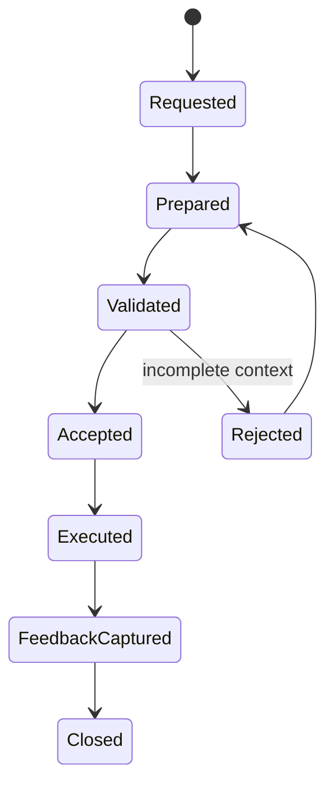
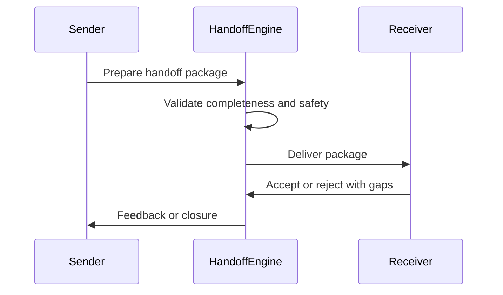

# Handoff Engine

## 1. Purpose

The Handoff Engine is the AI-SEOS operating engine responsible for transferring context, decisions, constraints, responsibilities and expected outputs between humans, agents, modules and phases without losing meaning.

In AI-SEOS, handoff is not a message.

Handoff is a structured engineering artifact.

## 2. Mission

The Handoff Engine ensures that every receiving role can act safely without re-discovering context, guessing priorities or violating previous decisions.

It must answer:

- Who is receiving the work?
- What is the objective?
- What context is required?
- Which decisions are binding?
- Which risks matter?
- Which constraints cannot be violated?
- What outputs are expected?
- What quality gates apply?
- What questions remain open?
- When must the receiver escalate?

## 3. Why this engine exists

AI-agentic workflows fail when context transfer is informal.

Common failures:

- an implementation agent ignores an ADR;
- QA tests the wrong behavior;
- documentation agent updates the wrong file;
- security agent reviews too late;
- product agent changes scope without architecture awareness;
- agents ask repeated questions already answered upstream;
- decisions are buried in chat history;
- downstream work starts with incomplete assumptions.

The Handoff Engine prevents these failures by standardizing context transfer.

## 4. Scope

The Handoff Engine governs:

- phase-to-phase handoff;
- agent-to-agent handoff;
- human-to-agent handoff;
- agent-to-human handoff;
- sprint handoff;
- implementation handoff;
- review handoff;
- release handoff;
- operational handoff;
- failure escalation handoff.

## 5. Handoff lifecycle

## 6. Handoff object model

### 6.1 Handoff Package

A complete package of context and instructions.

Attributes:

- ID;
- title;
- source role;
- receiving role;
- objective;
- context summary;
- required artifacts;
- binding decisions;
- constraints;
- risks;
- expected outputs;
- acceptance criteria;
- escalation triggers;
- status.

### 6.2 Handoff Contract

The agreement defining what the receiver must do and what the sender must provide.

### 6.3 Handoff Receipt

Confirmation that the receiver has enough context to proceed.

### 6.4 Handoff Gap

Any missing information that prevents safe execution.

## 7. Handoff types

| Type | Source | Receiver | Example |
|---|---|---|---|
| Discovery to Product | Discovery Engine | Product Engine | Discovery summary to PRD |
| Product to Architecture | Product Engine | Architecture Engine | PRD to architecture design |
| Architecture to Decision | Architecture Engine | Decision Engine | Alternatives to ADR decision |
| Decision to Risk | Decision Engine | Risk Engine | Chosen architecture to risk assessment |
| Optimization to Execution | Optimization Engine | Execution Engine | Simplified architecture to plan |
| Execution to Implementation | Execution Engine | Implementation Agent | Work package |
| Implementation to QA | Implementation Agent | QA Agent | Completed feature for validation |
| Execution to Documentation | Execution Engine | Documentation Agent | Docs update requirements |
| Release to Operations | Execution Engine | Ops Agent | Release package |
| Sprint to Sprint | Maintainer | Maintainer/Agent | Sprint handoff |

## 8. Handoff quality gates

### 8.1 Completeness Gate

Pass criteria:

- objective is clear;
- receiving role is identified;
- expected outputs are explicit;
- required context is present;
- constraints are listed;
- risks are listed;
- decisions are linked;
- acceptance criteria exist.

### 8.2 Traceability Gate

Pass criteria:

- handoff links to upstream artifacts;
- handoff links to related ADRs;
- handoff links to risks;
- handoff links to templates or protocols;
- receiving output path is known.

### 8.3 Safety Gate

Pass criteria:

- escalation triggers exist;
- unclear assumptions are marked;
- high-risk work requires review;
- security-sensitive work is flagged;
- irreversible decisions are not delegated silently.

### 8.4 Acceptance Gate

Pass criteria:

- receiver can explain objective;
- receiver can identify constraints;
- receiver can identify done criteria;
- receiver has no blocking missing context.

## 9. Handoff package standard

Every handoff package should include:

1. header metadata;
2. objective;
3. context summary;
4. source artifacts;
5. binding decisions;
6. assumptions;
7. constraints;
8. risks;
9. expected outputs;
10. acceptance criteria;
11. quality gates;
12. escalation triggers;
13. open questions;
14. completion evidence.

## 10. Escalation triggers

A receiving agent must escalate when:

- required artifact is missing;
- instruction conflicts with ADR;
- scope conflicts with PRD;
- implementation conflicts with architecture;
- risk is unmitigated;
- security implication is unclear;
- acceptance criteria are ambiguous;
- irreversible action is requested;
- cost impact exceeds known constraints;
- hallucinated or unverifiable context is detected.

## 11. Handoff integration with Context Package

The Handoff Engine extends the Context Package Standard from Sprint 1.

Context Package describes project state.

Handoff Package describes a transfer of responsibility.

A handoff package may embed or reference a context package.

## 12. Agent handoff protocol

Agent handoff must be explicit:

## 13. Anti-patterns

- "See previous chat" as handoff.
- Assigning tasks without context.
- Handoff without acceptance criteria.
- Handoff without related ADRs.
- Handoff without escalation rules.
- Handoff that delegates product decisions to implementation agents.
- Handoff that hides uncertainty.
- Handoff that omits risks to appear cleaner.

## 14. Definition of Done

The Handoff Engine is complete when:

- handoff lifecycle exists;
- handoff object model exists;
- handoff package standard exists;
- handoff contracts exist;
- agent handoff protocol exists;
- handoff templates exist;
- quality gates exist;
- ADR for Handoff Engine exists;
- Sprint 4 validation confirms integration with Execution and Documentation.
