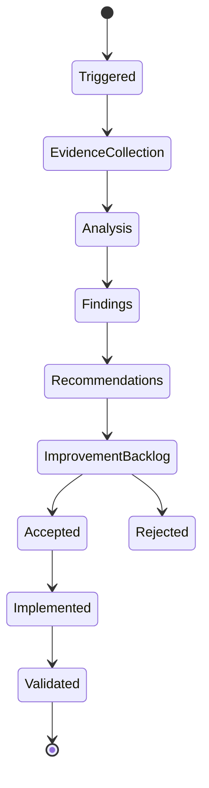
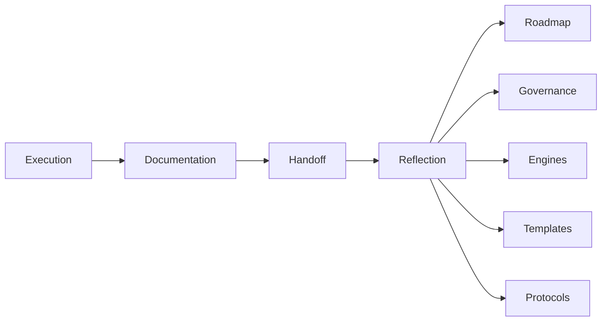

# Reflection Engine

## 1. Purpose

The Reflection Engine is the AI-SEOS operating engine responsible for reviewing outputs, decisions, execution, documentation and system behavior to improve future work.

It converts completed work into learning.

AI-SEOS is not complete when a sprint finishes. It is complete when the system has learned from the sprint.

## 2. Mission

The Reflection Engine ensures that AI-SEOS improves over time by detecting:

- weak decisions;
- repeated risks;
- documentation gaps;
- execution friction;
- unclear protocols;
- agent failure modes;
- quality gate weaknesses;
- architectural drift;
- process bottlenecks;
- missing templates;
- ineffective handoffs;
- outdated assumptions.

## 3. Why this engine exists

AI systems can produce a lot of output without developing institutional memory.

Human teams can repeat the same mistakes when retrospectives are vague.

The Reflection Engine creates structured learning loops.

## 4. Scope

The Reflection Engine governs:

- sprint retrospectives;
- architecture retrospectives;
- decision reviews;
- risk reviews;
- documentation reviews;
- agent performance reviews;
- handoff reviews;
- protocol improvement;
- quality gate improvement;
- framework evolution;
- lessons learned;
- backlog of systemic improvements.

## 5. Non-scope

It does not blame agents or humans.

It does not rewrite history.

It does not approve major changes without governance.

It produces recommendations, improvement tasks and escalation proposals.

## 6. Reflection lifecycle

## 7. Reflection triggers

Reflection must run:

- at the end of every sprint;
- after major ADR creation;
- after major architecture changes;
- after release candidate preparation;
- after incident or failure;
- when repeated blockers appear;
- when handoff is rejected;
- when documentation drift is detected;
- when quality gate fails;
- when human maintainer requests review.

## 8. Reflection object model

### 8.1 Reflection Report

A structured review artifact.

Attributes:

- ID;
- subject;
- trigger;
- evidence;
- findings;
- severity;
- recommendations;
- action items;
- owners;
- status.

### 8.2 Finding

An observed issue, pattern, strength or gap.

Types:

- decision finding;
- architecture finding;
- product finding;
- risk finding;
- documentation finding;
- execution finding;
- handoff finding;
- agent behavior finding;
- governance finding.

### 8.3 Improvement Item

A follow-up action created from reflection.

Attributes:

- ID;
- title;
- source finding;
- expected improvement;
- owner;
- priority;
- target sprint;
- status.

## 9. Reflection dimensions

| Dimension | Key Question |
|---|---|
| Product | Did we preserve user value and scope clarity? |
| Architecture | Did implementation and planning respect architecture? |
| Decision | Were decisions explicit and justified? |
| Risk | Were risks identified early enough? |
| Optimization | Did we simplify where possible? |
| Execution | Was work sequenced effectively? |
| Documentation | Is the repository more understandable now? |
| Handoff | Did receivers get enough context? |
| Agent Behavior | Did agents follow protocols? |
| Governance | Were decisions made at the right level? |

## 10. Quality gates

### 10.1 Evidence Gate

Reflection must be based on artifacts, not vague impressions.

Evidence may include:

- files changed;
- ADRs;
- validation reports;
- failed gates;
- rejected handoffs;
- unresolved risks;
- commit history;
- changelog;
- human feedback.

### 10.2 Specificity Gate

Findings must be specific enough to act on.

Bad:

> Documentation could be better.

Good:

> `templates/README.md` links to product templates but does not yet link execution templates, causing discoverability gap after Sprint 4.

### 10.3 Actionability Gate

Recommendations must define:

- action;
- owner;
- target artifact;
- expected outcome;
- priority.

### 10.4 Learning Gate

At least one systemic lesson should be extracted from every sprint.

## 11. Reflection review types

### 11.1 Sprint Reflection

Reviews a completed sprint.

### 11.2 Architecture Reflection

Reviews architectural consistency and drift.

### 11.3 Decision Reflection

Reviews ADR quality and decision outcomes.

### 11.4 Risk Reflection

Reviews whether risk assessment was accurate.

### 11.5 Handoff Reflection

Reviews whether context transfer worked.

### 11.6 Documentation Reflection

Reviews documentation quality and drift.

### 11.7 Agent Reflection

Reviews whether agents followed their protocols.

## 12. Improvement backlog

Reflection output must feed an improvement backlog.

Improvement backlog categories:

- documentation improvement;
- template improvement;
- protocol improvement;
- engine improvement;
- agent instruction improvement;
- governance improvement;
- automation opportunity;
- example/case study need;
- validation improvement.

## 13. Anti-patterns

- Retrospectives that only list what was done.
- Reflection without evidence.
- Recommendations without owners.
- Blaming agents instead of improving protocols.
- Ignoring repeated handoff failures.
- Accepting documentation drift as normal.
- Treating every issue as urgent.
- Creating improvement backlog items that never get reviewed.

## 14. Integration with AI-SEOS

The Reflection Engine closes the loop:

## 15. Definition of Done

The Reflection Engine is complete when:

- reflection lifecycle exists;
- reflection object model exists;
- reflection quality gates exist;
- reflection templates exist;
- system review playbook exists;
- retrospective protocol exists;
- improvement backlog template exists;
- ADR for Reflection Engine exists;
- Sprint 4 validation confirms the AI-SEOS operating loop is closed.
