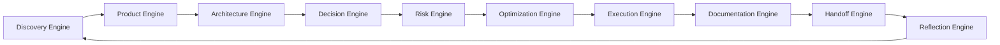

# AI-SEOS Frameworks Consolidation Strategy

## 1. Purpose

Sprint 5 exists to transform the AI-SEOS repository from a collection of operational engines into a coherent framework system.

Sprints 1 through 4 created the core operational lifecycle:



This lifecycle is valuable but still primarily engine-oriented. Sprint 5 must consolidate the reusable frameworks that make the system understandable, teachable, adaptable, and usable by different projects, teams, companies, and AI-agent configurations.

The objective is not to add isolated documents. The objective is to establish a framework layer that explains how AI-SEOS can be applied across contexts, project types, maturity levels, agent teams, governance models, and delivery scales.

## 2. Why Consolidation Is Required

Without a framework consolidation layer, AI-SEOS risks becoming a set of excellent but disconnected modules. Each engine may be useful, but users will not necessarily know:

- which framework to use first;
- how frameworks relate to engines;
- how to compose frameworks for different project types;
- how to assess readiness before moving forward;
- how to adapt depth according to project risk;
- how to avoid duplicating decisions across documents;
- how to govern framework evolution over time;
- how to compare maturity across teams;
- how to onboard new agents and contributors.

Sprint 5 must solve this by creating a common meta-framework layer.

## 3. Core Distinction: Engine vs Framework vs Protocol vs Template

AI-SEOS must maintain a strict separation between engines, frameworks, protocols, templates, playbooks, and agents.

### 3.1 Engine

An engine is an operational capability of the AI-SEOS lifecycle. It performs a function in the system.

Examples:

- Discovery Engine
- Product Engine
- Architecture Engine
- Decision Engine
- Risk Engine
- Optimization Engine
- Execution Engine
- Documentation Engine
- Handoff Engine
- Reflection Engine

An engine answers: **what operational capability exists?**

### 3.2 Framework

A framework is a reusable conceptual system for applying one or more engines consistently.

Examples:

- Discovery Framework
- MVP Scope Framework
- Decision Framework
- Risk Framework
- Optimization Framework
- Execution Framework
- Documentation Framework
- Handoff Framework
- Reflection Framework
- AI-SEOS Meta-Framework
- Project Readiness Framework
- Agent Collaboration Framework

A framework answers: **how should practitioners think and structure the work?**

### 3.3 Protocol

A protocol is a step-by-step execution rule for a recurring workflow.

Examples:

- Project Discovery Protocol
- Product Definition Protocol
- Architecture Review Protocol
- Decision Review Protocol
- Risk Assessment Protocol
- Optimization Review Protocol
- Execution Planning Protocol
- Handoff Protocol
- Reflection Review Protocol

A protocol answers: **what procedure must be followed?**

### 3.4 Template

A template is a reusable document structure.

Examples:

- Discovery Document Template
- PRD Template
- ADR Template
- Risk Register Template
- Architecture Overview Template
- Execution Plan Template
- Handoff Package Template
- Retrospective Template

A template answers: **what artifact should be produced?**

### 3.5 Playbook

A playbook is an applied guide for a context or scenario.

Examples:

- Greenfield SaaS Playbook
- Legacy Modernization Playbook
- AI-First Product Playbook
- System Review Playbook

A playbook answers: **how do we apply AI-SEOS in a real-world situation?**

### 3.6 Agent

An agent is an actor that executes responsibilities using engines, frameworks, protocols, and templates.

Examples:

- AI CTO & Solution Architect
- Product Owner Agent
- Principal Architect Agent
- Security Agent
- QA Agent
- Implementation Lead Agent
- Documentation Agent

An agent answers: **who performs the work?**

## 4. Consolidation Principles

Sprint 5 must apply the following principles.

### 4.1 No Duplicate Frameworks

If two frameworks solve the same problem, consolidate them or explicitly define their boundary.

### 4.2 Explicit Interface Contracts

Every framework must define:

- inputs;
- outputs;
- required upstream artifacts;
- downstream consumers;
- quality gates;
- failure modes;
- examples;
- maturity indicators.

### 4.3 Frameworks Must Be Engine-Aware

A framework cannot exist as an abstract essay. It must clearly state which engines it depends on and which engines it enables.

### 4.4 Frameworks Must Be Agent-Executable

Every framework must be usable by an AI agent. That means instructions must be operational, not just descriptive.

### 4.5 Frameworks Must Be Human-Reviewable

Every framework must produce artifacts that humans can review, challenge, approve, reject, or request revision for.

### 4.6 Frameworks Must Scale by Depth

AI-SEOS frameworks must support different depths:

- Level 0: Quick framing
- Level 1: Standard project use
- Level 2: Professional production use
- Level 3: Enterprise/high-risk use

### 4.7 Frameworks Must Support Evolution

Frameworks must have versions, status, owners, and change rules. A framework without governance becomes a stale document.

## 5. Framework Catalog Requirements

Codex must create a complete framework catalog at:

```text
/docs/frameworks/framework-catalog.md
```

The catalog must include at least:

| Framework | Purpose | Primary Engine | Upstream Inputs | Downstream Outputs | Maturity |
|---|---|---|---|---|---|
| Discovery Framework | Understand problem, users, domain, constraints | Discovery | Idea, context | Discovery document, assumptions, constraints | Initial |
| Product Framework | Convert discovery into product definition | Product | Discovery outputs | PRD, MVP, roadmap | Initial |
| Architecture Framework | Convert product context into architecture | Architecture | PRD, NFRs, constraints | Architecture overview, domain model | Initial |
| Decision Framework | Decide among alternatives | Decision | Options, criteria | Decision record, ADR | Initial |
| Risk Framework | Identify and govern uncertainty | Risk | Architecture, decisions | Risk register, mitigation plan | Initial |
| Optimization Framework | Improve cost, complexity and scalability | Optimization | Risks, decisions | Optimization plan | Initial |
| Execution Framework | Convert readiness into execution plan | Execution | Product, architecture, decisions | Work packages, milestones | Initial |
| Documentation Framework | Maintain documentation as system memory | Documentation | All artifacts | Docs, indexes, drift controls | Initial |
| Handoff Framework | Transfer context between agents | Handoff | Completed artifacts | Handoff package, receipt | Initial |
| Reflection Framework | Learn from outcomes | Reflection | Execution and system state | Retrospective, improvement backlog | Initial |
| AI-SEOS Meta-Framework | Compose all frameworks end to end | Cross-engine | Project context | Full operating path | New |
| Project Readiness Framework | Assess readiness across lifecycle | Cross-engine | Engine outputs | Readiness scorecards | New |
| Agent Collaboration Framework | Govern multi-agent work | Cross-agent | Agent roles, handoffs | Collaboration map | New |

## 6. Framework Taxonomy

Codex must create:

```text
/docs/frameworks/framework-taxonomy.md
```

This taxonomy must classify frameworks by type:

### 6.1 Lifecycle Frameworks

Frameworks that cover a lifecycle stage.

- Discovery Framework
- Product Framework
- Architecture Framework
- Execution Framework
- Reflection Framework

### 6.2 Decision and Governance Frameworks

Frameworks that govern choices and accountability.

- Decision Framework
- ADR Framework
- Risk Framework
- Governance Framework
- Project Readiness Framework

### 6.3 Optimization Frameworks

Frameworks that improve outcomes.

- Optimization Framework
- Cost Optimization Framework
- Complexity Optimization Framework
- Scalability Optimization Framework
- Documentation Quality Framework

### 6.4 Collaboration Frameworks

Frameworks that coordinate agents and humans.

- Agent Collaboration Framework
- Handoff Framework
- Human-AI Review Framework

### 6.5 Meta-Frameworks

Frameworks that compose other frameworks.

- AI-SEOS Meta-Framework
- Discovery-to-Delivery Framework
- Project Lifecycle Framework

## 7. Framework Consolidation Work Products

Sprint 5 must produce the following canonical work products:

```text
frameworks/ai-seos-meta-framework/README.md
frameworks/ai-seos-meta-framework/meta-framework.md
frameworks/cross-engine-integration/README.md
frameworks/cross-engine-integration/integration-model.md
frameworks/maturity-model/README.md
frameworks/maturity-model/ai-seos-maturity-model.md
frameworks/project-readiness/README.md
frameworks/project-readiness/readiness-scorecards.md
frameworks/agent-collaboration/README.md
frameworks/agent-collaboration/agent-collaboration-framework.md
frameworks/quality-assurance/README.md
frameworks/quality-assurance/framework-quality-assurance.md
frameworks/reference-implementation/README.md
frameworks/reference-implementation/reference-implementation-framework.md
```

Additionally, Codex must create:

```text
docs/frameworks/README.md
docs/frameworks/framework-catalog.md
docs/frameworks/framework-taxonomy.md
docs/frameworks/framework-map.md
docs/frameworks/framework-evolution-policy.md
```

## 8. Required ADR

Codex must create:

```text
adr/0037-adopt-framework-consolidation-layer.md
```

ADR 0037 must state that AI-SEOS requires a framework consolidation layer because engines alone are insufficient for adoption, governance, training, and long-term project evolution.

## 9. Quality Gates

Sprint 5 consolidation is not complete until:

- all existing frameworks are indexed;
- framework boundaries are defined;
- engine-to-framework mapping exists;
- framework-to-protocol mapping exists;
- framework-to-template mapping exists;
- cross-engine integration model exists;
- maturity model exists;
- project readiness scorecards exist;
- agent collaboration framework exists;
- framework governance rules exist;
- ADR 0037 is created;
- README, ROADMAP, CHANGELOG and framework indexes are updated.

## 10. Implementation Directive

Codex must not treat this document as an essay. Codex must use it as a specification to create and update repository artifacts.

The final result of Sprint 5 must make AI-SEOS easier to understand, easier to teach, easier to apply, easier to review, and easier to evolve.
