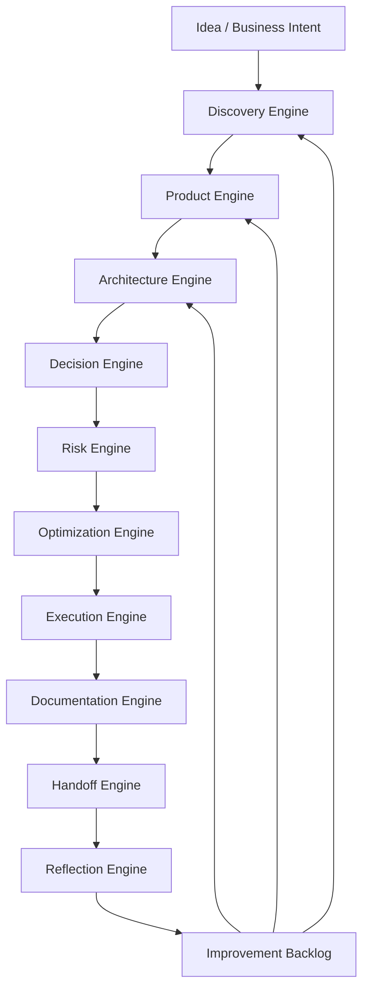

# AI-SEOS Cross-Engine Integration Model

## 1. Purpose

The Cross-Engine Integration Model defines how AI-SEOS engines collaborate as a complete operating system.

AI-SEOS must never become a sequence of disconnected documents. Each engine must consume upstream artifacts, enrich or validate them, and produce downstream artifacts in a controlled way.

This model exists to make the whole lifecycle traceable:



## 2. Integration Philosophy

The integration model is based on five ideas.

### 2.1 Artifacts Are the System Memory

Agents do not merely pass chat context. They pass artifacts.

Every engine must produce durable outputs that can be reviewed, versioned and re-used.

### 2.2 Handoffs Are Explicit Contracts

Every transition between engines requires an input-output contract.

A handoff is valid only when:

- upstream outputs exist;
- assumptions are visible;
- unresolved questions are listed;
- risks are not hidden;
- downstream responsibilities are clear;
- acceptance criteria are defined.

### 2.3 Decisions Must Be Traceable

A product decision must trace to discovery. An architecture decision must trace to product needs. A risk decision must trace to architecture and business context. An execution plan must trace to readiness.

### 2.4 Feedback Loops Are Mandatory

AI-SEOS is not waterfall. It is a structured iterative system.

Reflection can send feedback to any earlier engine.

### 2.5 Depth Must Match Risk

Low-risk projects can use lighter paths. High-risk projects must use deeper assessments.

## 3. Engine Interface Standard

Every engine must define its interface using the following format:

```yaml
engine: <engine-name>
version: <version>
status: <draft|active|stable|deprecated>
upstream_engines:
  - <engine>
inputs:
  - artifact: <artifact-name>
    required: true|false
    quality_gate: <gate-name>
outputs:
  - artifact: <artifact-name>
    consumer: <engine-or-agent>
quality_gates:
  - <gate>
failure_modes:
  - <failure-mode>
rollback_or_rework:
  - <rule>
```

Codex must create this standard at:

```text
templates/cross-engine/engine-interface-template.md
```

## 4. Canonical Engine Flow

### 4.1 Discovery → Product

Discovery outputs:

- problem statement;
- user segments;
- stakeholder map;
- domain facts;
- assumptions;
- constraints;
- success metrics;
- opportunity areas;
- validation gaps.

Product consumes these outputs to create:

- product vision;
- PRD;
- MVP definition;
- scope boundary;
- feature candidates;
- roadmap;
- product readiness level.

Invalid handoff examples:

- PRD created without validated user problem;
- MVP created without explicit non-goals;
- roadmap created without constraints;
- success metrics missing.

### 4.2 Product → Architecture

Product outputs:

- PRD;
- MVP scope;
- functional requirements;
- non-functional requirements;
- user journeys;
- constraints;
- roadmap.

Architecture consumes these outputs to create:

- architecture overview;
- domain model;
- context diagram;
- container view;
- integration map;
- technology alternatives;
- architecture readiness level.

Invalid handoff examples:

- architecture selected before NFRs;
- platform choice without cost/risk discussion;
- domain model missing;
- integration boundaries unclear.

### 4.3 Architecture → Decision

Architecture outputs:

- options;
- constraints;
- trade-offs;
- domain model;
- architecture views;
- open issues.

Decision consumes these outputs to produce:

- weighted decision matrix;
- decision confidence;
- ADRs;
- decision log updates;
- reversibility model.

Invalid handoff examples:

- decision made with only one option;
- no reversal strategy for high-impact decision;
- no documented criteria;
- no evidence level.

### 4.4 Decision → Risk

Decision outputs:

- accepted decisions;
- rejected alternatives;
- consequences;
- known trade-offs;
- assumptions.

Risk consumes these outputs to produce:

- risk register;
- risk score;
- mitigation plan;
- owner assignment;
- escalation triggers.

Invalid handoff examples:

- high-impact ADR without risk entry;
- security implications not assessed;
- vendor lock-in ignored;
- compliance assumptions undocumented.

### 4.5 Risk → Optimization

Risk outputs:

- prioritized risks;
- mitigations;
- unresolved uncertainties;
- cost exposure;
- operational exposure.

Optimization consumes these outputs to produce:

- simplification opportunities;
- cost optimization plan;
- scalability strategy;
- complexity reduction plan;
- AI cost and latency review where applicable.

Invalid handoff examples:

- optimization that violates security;
- cost reduction that increases operational fragility;
- scalability plan without product growth assumptions;
- premature optimization.

### 4.6 Optimization → Execution

Optimization outputs:

- final architecture recommendations;
- accepted simplifications;
- optimization backlog;
- readiness status.

Execution consumes these outputs to produce:

- milestones;
- work packages;
- sprint plan;
- dependency map;
- delivery roadmap;
- execution readiness level.

Invalid handoff examples:

- sprint backlog without architecture decisions;
- tasks without acceptance criteria;
- dependencies not sequenced;
- risks not assigned.

### 4.7 Execution → Documentation

Execution outputs:

- implementation plan;
- work packages;
- delivery status;
- changes;
- deviations.

Documentation consumes these outputs to produce:

- updated docs;
- traceability links;
- doc drift report;
- changelog updates;
- decision log updates.

### 4.8 Documentation → Handoff

Documentation outputs:

- current source of truth;
- artifact indexes;
- known gaps;
- validated document set.

Handoff consumes these outputs to produce:

- handoff package;
- handoff receipt;
- downstream instructions;
- unresolved context list.

### 4.9 Handoff → Reflection

Handoff outputs:

- completed package;
- acceptance receipt;
- gaps;
- questions.

Reflection consumes these outputs to produce:

- retrospective;
- lessons learned;
- improvement backlog;
- framework improvement proposals.

## 5. Cross-Engine Traceability Matrix

Codex must create:

```text
frameworks/cross-engine-integration/traceability-matrix.md
```

The matrix must include:

| Source Artifact | Producing Engine | Consuming Engine | Required? | Quality Gate | Trace Target |
|---|---|---|---|---|---|
| Problem Statement | Discovery | Product | Yes | Problem clarity | PRD |
| PRD | Product | Architecture | Yes | Scope clarity | Architecture Overview |
| Architecture Options | Architecture | Decision | Yes | Option completeness | ADR |
| ADR | Decision | Risk | Yes | Consequence clarity | Risk Register |
| Risk Register | Risk | Optimization | Yes | Risk prioritization | Optimization Plan |
| Optimization Plan | Optimization | Execution | Yes | Feasibility | Execution Plan |
| Execution Plan | Execution | Documentation | Yes | Delivery readiness | Documentation Plan |
| Documentation Index | Documentation | Handoff | Yes | Source of truth | Handoff Package |
| Handoff Receipt | Handoff | Reflection | Yes | Acceptance | Retrospective |

## 6. Cross-Engine Failure Modes

Codex must document at least these failure modes:

1. Premature architecture before discovery.
2. Product scope without validated problem.
3. Decision without alternatives.
4. ADR without consequences.
5. Risk register created after execution starts.
6. Optimization used to justify underengineering.
7. Execution plan without readiness.
8. Documentation generated after the fact.
9. Handoff without ownership.
10. Reflection without improvement backlog.

## 7. Required Protocol

Codex must create:

```text
protocols/cross-engine-integration/README.md
protocols/cross-engine-integration/cross-engine-handoff-protocol.md
```

The protocol must define:

- when an engine can start;
- required upstream artifacts;
- minimum quality gates;
- blocking conditions;
- escalation rules;
- rework loops;
- validation process.

## 8. Required ADR

Codex must create:

```text
adr/0038-adopt-cross-engine-integration-model.md
```

ADR 0038 must define that AI-SEOS engines operate through explicit artifact contracts, not implicit conversational context.

## 9. Definition of Done

The Cross-Engine Integration Model is done when:

- engine interface standard exists;
- cross-engine handoff protocol exists;
- traceability matrix exists;
- integration map exists;
- failure modes are documented;
- ADR 0038 exists;
- related READMEs are updated.
