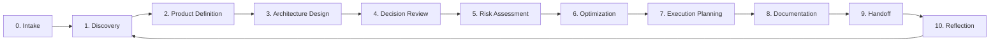

# Discovery-to-Delivery Meta-Framework

## 1. Purpose

The Discovery-to-Delivery Meta-Framework defines the standard end-to-end path for applying AI-SEOS to a software project.

It connects all engines into a single operating path that can begin with a raw idea and end with an execution-ready, documented, reviewable, and continuously improvable project structure.

This framework is the user-facing explanation of how AI-SEOS works in practice.

## 2. Core Promise

Given only an idea, AI-SEOS should guide a human or agent team through:

1. understanding the problem;
2. defining the product;
3. designing the architecture;
4. making decisions;
5. identifying risks;
6. optimizing the approach;
7. planning execution;
8. documenting the system;
9. handing off work;
10. reflecting and improving.

## 3. Meta-Framework Stages



## 4. Stage 0 — Intake

### Objective

Capture the initial idea, context and intent without forcing premature structure.

### Inputs

- Raw idea
- Business context
- Known constraints
- Desired outcome
- Existing materials
- Human expectations

### Outputs

- Intake brief
- Initial assumptions
- Initial unknowns
- Recommended discovery depth

### Quality Gates

- Idea is captured in plain language.
- Known constraints are explicit.
- Unknowns are not hidden.
- Discovery depth is selected.

## 5. Stage 1 — Discovery

### Objective

Understand the problem, users, stakeholders, domain, constraints, alternatives and success metrics.

### Outputs

- Discovery document
- Stakeholder map
- User segments
- Problem statement
- Domain notes
- Constraint register
- Assumption register
- Validation gaps

### Exit Criteria

- problem is clear;
- target users are defined;
- success metrics are known;
- constraints are visible;
- assumptions are separated from facts;
- downstream Product Engine can proceed.

## 6. Stage 2 — Product Definition

### Objective

Convert discovery into a coherent product definition.

### Outputs

- Product vision
- PRD
- MVP scope
- Non-goals
- Feature candidates
- Roadmap
- Product readiness level

### Exit Criteria

- MVP is bounded;
- value proposition is clear;
- user journeys are defined;
- requirements are prioritized;
- architecture has enough product context.

## 7. Stage 3 — Architecture Design

### Objective

Design a system architecture that supports the product with explicit trade-offs.

### Outputs

- Architecture overview
- System context
- Container view
- Domain model
- Integration model
- Technology options
- NFR mapping
- Architecture readiness level

### Exit Criteria

- architecture alternatives are visible;
- domain boundaries exist;
- integrations are mapped;
- NFRs are addressed;
- decisions requiring ADR are identified.

## 8. Stage 4 — Decision Review

### Objective

Make consequential decisions through explicit comparison and traceability.

### Outputs

- Decision matrix
- ADRs
- Decision log updates
- Confidence assessment
- Reversibility notes

### Exit Criteria

- at least three viable alternatives were considered for major decisions;
- criteria are explicit;
- selected option is justified;
- consequences are documented;
- risk review can proceed.

## 9. Stage 5 — Risk Assessment

### Objective

Identify, classify, prioritize and mitigate risks.

### Outputs

- Risk register
- Risk heatmap
- Mitigation plan
- Risk owners
- Escalation triggers

### Exit Criteria

- major risks are visible;
- unacceptable risks are escalated;
- mitigations are assigned;
- residual risk is understood.

## 10. Stage 6 — Optimization

### Objective

Improve the solution before execution by reducing unnecessary complexity, cost, risk and operational burden.

### Outputs

- Optimization review
- Complexity reduction plan
- Cost optimization plan
- Scalability review
- Maintainability review
- AI cost/latency review when applicable

### Exit Criteria

- no obvious simpler alternative is ignored;
- cost model is reasonable;
- architecture is not prematurely overengineered;
- execution can proceed.

## 11. Stage 7 — Execution Planning

### Objective

Convert readiness into executable work.

### Outputs

- Execution plan
- Milestones
- Work packages
- Sprint backlog
- Dependency map
- Acceptance criteria
- Delivery risks

### Exit Criteria

- work is sequenced;
- dependencies are visible;
- owners or agent roles are assigned;
- acceptance criteria exist;
- delivery can begin.

## 12. Stage 8 — Documentation

### Objective

Ensure artifacts become durable system memory.

### Outputs

- Documentation index
- Updated README files
- Changelog updates
- ADR index
- Architecture docs
- Drift report

### Exit Criteria

- source of truth is clear;
- artifacts are findable;
- decisions are traceable;
- stale references are identified.

## 13. Stage 9 — Handoff

### Objective

Transfer context to the next agent, team or workflow.

### Outputs

- Handoff package
- Handoff receipt
- Open questions
- Next-agent instructions
- Acceptance status

### Exit Criteria

- receiver can continue without guessing;
- gaps are explicit;
- next actions are clear.

## 14. Stage 10 — Reflection

### Objective

Close the learning loop.

### Outputs

- Retrospective
- Lessons learned
- Improvement backlog
- Framework improvement proposals

### Exit Criteria

- problems are not repeated silently;
- process improvements are captured;
- framework evolution is informed by evidence.

## 15. Operating Paths

AI-SEOS must support multiple operating paths.

### 15.1 Lightweight Path

For experiments, prototypes and low-risk projects.

Required stages:

- Intake
- Discovery Lite
- MVP Scope
- Architecture Lite
- Decision Notes
- Execution Plan

### 15.2 Standard Path

For professional production projects.

Required stages:

- Intake
- Discovery
- PRD
- Architecture
- ADRs
- Risk Register
- Optimization Review
- Execution Plan
- Documentation
- Handoff
- Reflection

### 15.3 Enterprise Path

For high-risk, regulated, expensive or long-lived systems.

Requires all standard path artifacts plus:

- stakeholder governance;
- compliance review;
- security architecture review;
- cost model;
- operational readiness;
- migration strategy;
- rollback strategy;
- formal review board;
- multi-agent handoff chain;
- maturity assessment.

## 16. Required Artifacts

Codex must create:

```text
frameworks/ai-seos-meta-framework/README.md
frameworks/ai-seos-meta-framework/meta-framework.md
frameworks/ai-seos-meta-framework/discovery-to-delivery-framework.md
frameworks/ai-seos-meta-framework/operating-paths.md
templates/meta-framework/project-operating-path-template.md
templates/meta-framework/intake-brief-template.md
```

## 17. Required ADR

Codex must create:

```text
adr/0040-adopt-discovery-to-delivery-meta-framework.md
```

ADR 0040 must explain why AI-SEOS needs a single end-to-end operating path for adoption, onboarding and project execution.

## 18. Definition of Done

The meta-framework is complete when:

- stages 0 to 10 are documented;
- lightweight, standard and enterprise paths exist;
- required artifacts are mapped;
- operating path template exists;
- ADR 0040 exists;
- README and framework catalog reference the meta-framework.
