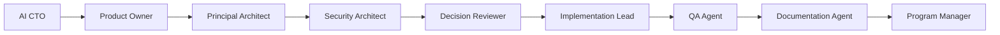

# Agent Collaboration Framework

## 1. Purpose

The Agent Collaboration Framework defines how specialized AI agents cooperate inside AI-SEOS.

AI-SEOS assumes that high-quality software engineering cannot be reliably handled by one generic agent acting alone. Instead, the system should support specialized agents that operate through clear responsibilities, artifacts, protocols, review boundaries, and handoffs.

## 2. Collaboration Philosophy

AI-SEOS agent collaboration is based on role clarity, artifact continuity, human accountability, and explicit handoffs.

Agents must not collaborate by vague conversation alone. They collaborate through structured artifacts.

## 3. Primary Agent Types

Sprint 5 must define a canonical collaboration model for at least these agents:

| Agent | Primary Responsibility | Primary Engines |
|---|---|---|
| AI CTO & Solution Architect | Overall technical strategy and project framing | Core, Discovery, Architecture, Decision |
| Product Owner Agent | Product vision, PRD, MVP and backlog | Product |
| Principal Architect Agent | Architecture design and technical trade-offs | Architecture, Decision, Risk |
| Security Architect Agent | Threats, security requirements and compliance risks | Risk, Architecture |
| Implementation Lead Agent | Execution planning and engineering sequencing | Execution |
| QA & Validation Agent | Acceptance criteria, test strategy and quality validation | Execution, Reflection |
| Documentation Agent | Documentation maintenance and information architecture | Documentation |
| DevOps / Platform Agent | Deployment, observability, platform and operational readiness | Architecture, Execution, Risk |
| Reviewer Agent | Independent review of decisions, docs and readiness | Decision, Risk, Reflection |
| Program Manager Agent | Milestones, dependencies, delivery governance and status | Execution, Handoff |

## 4. Agent Operating Contract

Every agent must define:

```yaml
agent: <agent-name>
version: <version>
mission: <mission>
primary_engines:
  - <engine>
inputs:
  - <artifact>
outputs:
  - <artifact>
can_decide:
  - <decision-type>
must_escalate:
  - <condition>
must_not_do:
  - <boundary>
quality_gates:
  - <gate>
handoff_targets:
  - <agent>
```

Codex must create this as:

```text
templates/agent-collaboration/agent-operating-contract-template.md
```

## 5. Collaboration Topologies

AI-SEOS must support multiple collaboration topologies.

### 5.1 Solo AI CTO Topology

A single AI CTO orchestrates all engines and produces handoff artifacts.

Suitable for:

- early ideation;
- small projects;
- founder-led MVPs;
- technical planning;
- initial architecture framing.

Risk:

- insufficient independent challenge;
- security or QA blind spots;
- product assumptions may go unchecked.

### 5.2 Specialist Chain Topology

Agents operate in sequence:



Suitable for:

- standard professional projects;
- SaaS builds;
- customer-facing applications;
- multi-sprint work.

### 5.3 Review Board Topology

Multiple agents review the same decision from different perspectives.

Suitable for:

- high-impact architecture decisions;
- regulated domains;
- security-sensitive systems;
- expensive infrastructure decisions;
- enterprise migrations.

### 5.4 Swarm with Coordinator Topology

A coordinator agent decomposes work and multiple specialist agents work in parallel.

Suitable for:

- large documentation generation;
- reference implementation expansion;
- template creation;
- example projects;
- audits.

Risk:

- duplicated effort;
- inconsistent terminology;
- conflicting artifacts;
- lack of final synthesis.

## 6. Human Review Model

AI-SEOS must define where human review is mandatory.

Human review is required for:

- business-critical product scope;
- irreversible architecture decisions;
- security exceptions;
- compliance assumptions;
- high-cost infrastructure decisions;
- production launch readiness;
- license and governance changes;
- public documentation positioning.

AI agents may recommend, draft and compare. They must not silently finalize high-impact decisions without human review unless explicitly delegated.

## 7. Agent Handoff Map

Codex must create:

```text
frameworks/agent-collaboration/agent-handoff-map.md
```

The map must define:

| From Agent | To Agent | Required Package | Acceptance Criteria |
|---|---|---|---|
| AI CTO | Product Owner | Discovery + Context Package | Product scope can be defined |
| Product Owner | Principal Architect | PRD + MVP + NFRs | Architecture can be designed |
| Principal Architect | Security Architect | Architecture overview + ADR candidates | Risks can be assessed |
| Security Architect | Decision Reviewer | Risk register + mitigations | Decisions can be reviewed |
| Decision Reviewer | Implementation Lead | ADRs + approved architecture | Execution plan can be created |
| Implementation Lead | QA Agent | Work packages + acceptance criteria | Test strategy can be created |
| QA Agent | Documentation Agent | Validation notes + quality gaps | Docs can be updated |
| Documentation Agent | Program Manager | Documentation index + handoff package | Delivery status can be managed |
| Program Manager | Reflection Agent | Delivery outcome + open gaps | Retrospective can be produced |

## 8. Agent Conflict Resolution

Agents may disagree. AI-SEOS must define conflict resolution rules.

### 8.1 Product vs Architecture

If Product wants scope that Architecture deems too costly or risky:

- create trade-off matrix;
- define reduced scope alternatives;
- escalate to AI CTO;
- produce decision record.

### 8.2 Security vs Delivery

If Security blocks a delivery decision:

- classify risk severity;
- define compensating controls;
- document exception if accepted;
- require human approval for high risk.

### 8.3 Optimization vs Maintainability

If Optimization proposes cheaper but less maintainable design:

- quantify savings;
- quantify operational burden;
- compare reversal cost;
- decide through Decision Engine.

## 9. Required Artifacts

Codex must create:

```text
frameworks/agent-collaboration/README.md
frameworks/agent-collaboration/agent-collaboration-framework.md
frameworks/agent-collaboration/agent-role-map.md
frameworks/agent-collaboration/agent-handoff-map.md
frameworks/agent-collaboration/agent-conflict-resolution.md
protocols/agent-collaboration/README.md
protocols/agent-collaboration/agent-collaboration-protocol.md
templates/agent-collaboration/agent-operating-contract-template.md
templates/agent-collaboration/agent-handoff-map-template.md
templates/agent-collaboration/agent-review-board-template.md
```

## 10. Required ADR

Codex must create:

```text
adr/0041-adopt-agent-collaboration-framework.md
```

ADR 0041 must explain why AI-SEOS requires multi-agent collaboration rules instead of treating all work as a single-agent prompt workflow.

## 11. Definition of Done

The Agent Collaboration Framework is complete when:

- core agent roles are documented;
- agent operating contract template exists;
- collaboration topologies exist;
- human review model exists;
- handoff map exists;
- conflict resolution rules exist;
- ADR 0041 exists;
- agents/README.md references the framework.
