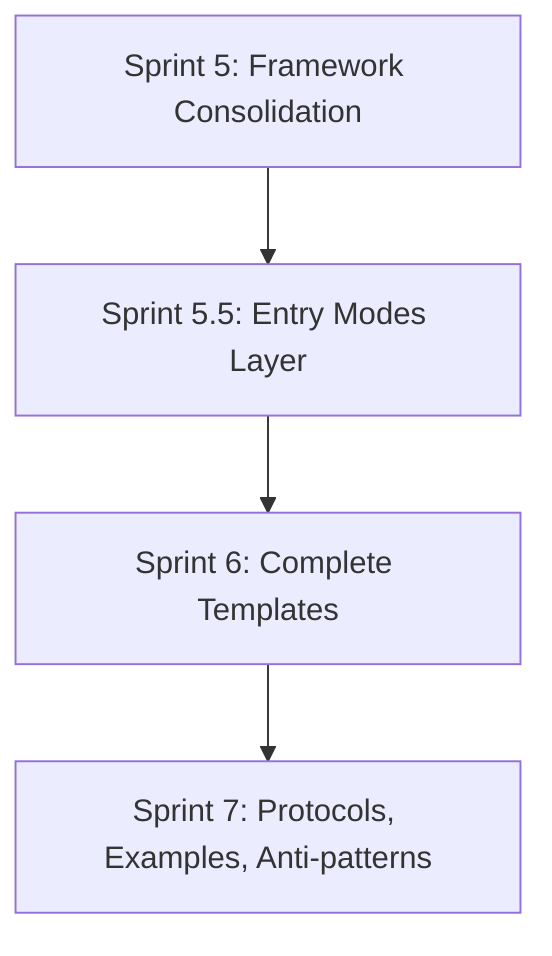
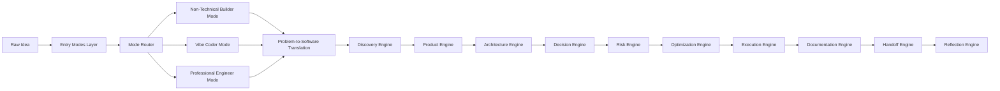

# Sprint 5.5 — Entry Modes Layer Rationale

## 1. Purpose

Sprint 5.5 exists to introduce the **Entry Modes Layer** into the AI Software Engineering Operating System (AI-SEOS) before Sprint 6 begins.

The original roadmap defined Sprint 6 as the sprint for complete templates. However, after Sprint 5 consolidated the cross-engine framework architecture, a critical product and adoption gap became visible: the AI-SEOS currently assumes that the person using the framework understands at least some software engineering concepts.

That assumption is not always true.

AI-SEOS is intended to serve both:

1. professional software teams; and
2. people who simply want to solve real-world problems with software, even if they do not know what GitHub, Vercel, backend, API, database, repository, deployment, authentication, or cloud infrastructure mean.

The framework therefore needs an explicit entry layer that adapts the system to different user maturity profiles before sending the user into Discovery, Product, Architecture, Decision, Risk, Optimization, Execution, Documentation, Handoff, and Reflection.

## 2. Why Sprint 5.5 Exists

Sprint 5.5 is not a deviation from the roadmap. It is an architectural correction made at the right time.

Sprint 5 completed the framework consolidation layer. That means the system now has:

- cross-engine integration;
- maturity model;
- readiness scorecards;
- governance model;
- agent collaboration framework;
- reference implementation structure;
- quality assurance framework;
- traceability model.

Sprint 6 was expected to create complete template packs. But if Sprint 6 starts before defining user entry modes, the templates will be created with only one implicit audience: programmers and technical operators.

That would create three problems:

1. **Template bias** — templates would be too technical for non-technical builders.
2. **Adoption friction** — vibe coders and non-technical users would not know where to start.
3. **Retrofitting cost** — after Sprint 6, every template would need to be rewritten or duplicated for different skill levels.

Sprint 5.5 prevents that.

It adds the entry architecture before the template system is expanded.

## 3. Why This Is Not Sprint 6

Sprint 6 is about **templates**.

Sprint 5.5 is about **entry architecture**.

A template answers:

> What document should be filled?

An entry mode answers:

> Who is using the framework, how much technical knowledge do they have, what language should the system use, what questions should it ask, and what type of output should be generated first?

Those are different concerns.

If the framework jumps directly to templates, it creates documents before defining the user experience and intake logic. That would make the templates structurally incomplete.

Sprint 5.5 therefore acts as a bridge between framework consolidation and template expansion.

## 4. What Sprint 5.5 Adds

Sprint 5.5 introduces three official user entry modes:

1. **Non-Technical Builder**
2. **Vibe Coder**
3. **Professional Engineer**

These modes do not replace the core lifecycle of AI-SEOS. They determine how a user enters the lifecycle.

All modes eventually converge into the same operating system:

## 5. What Problem This Solves

Many people who want to build software do not know how to describe software.

They do not say:

> I need a multi-tenant SaaS with authentication, billing integration, role-based access control, audit trail and dashboard views.

They say:

> I need a simple system to control who paid me and who still owes me.

A professional engineer can translate that into technical concepts. A non-technical builder cannot.

AI-SEOS must become that translator.

The Entry Modes Layer makes the framework capable of:

- interviewing a user in plain language;
- understanding a real-world workflow;
- identifying entities, actors, actions, data, risks, and desired outcomes;
- translating non-technical answers into structured software artifacts;
- recommending whether the solution should be no-code, low-code, AI-assisted code, or professional custom software;
- preparing an implementation-ready context package for Codex or another engineering agent.

## 6. The Three Modes

### 6.1 Non-Technical Builder

For people who do not know software terminology.

The system must avoid technical jargon at the beginning and ask questions about daily life, manual processes, pain, time loss, operational mistakes, money loss, repeated work, communication gaps, and desired outcomes.

Example question:

> Today, how do you solve this problem: paper, WhatsApp, spreadsheet, memory, or another system?

### 6.2 Vibe Coder

For people who use AI tools to build software but do not yet have strong engineering discipline.

The system should provide practical implementation guidance while protecting the user from chaotic execution, overengineering, fragile architecture, unclear scope, and unreviewed AI-generated code.

Example output:

> Build this in five controlled phases: authentication, core data model, main dashboard, first workflow, validation and deploy.

### 6.3 Professional Engineer

For programmers, tech leads, architects, consultants, and engineering teams.

The system can use technical language, demand stronger artifacts, and generate complete engineering documents: PRD, architecture overview, domain model, ADRs, risk register, execution plan, quality gates and handoff packages.

## 7. Design Principle

The language changes.

The engineering quality does not.

AI-SEOS must not become shallow in Non-Technical Builder Mode. It must hide complexity from the user while still preserving engineering rigor internally.

The user may say:

> I need to organize my clients.

The internal output must still identify:

- user roles;
- entities;
- permissions;
- data ownership;
- privacy risks;
- workflow states;
- MVP scope;
- future scalability concerns;
- implementation risks;
- handoff requirements.

## 8. Sprint 5.5 Definition of Done

Sprint 5.5 is complete when:

- Entry Modes Layer is documented.
- All three modes are formally defined.
- Mode Router is specified.
- Problem-to-Software Translation Framework is defined.
- Builder Intake Protocol is created.
- Templates required for Sprint 6 are mapped.
- ADRs 0046 to 0051 are created.
- README, ROADMAP, CHANGELOG and relevant indexes are updated.
- Sprint 5.5 handoff, validation report and retrospective are created.

## 9. Required ADRs

Sprint 5.5 must create:

- ADR 0046 — Adopt Entry Modes Layer
- ADR 0047 — Adopt Non-Technical Builder Mode
- ADR 0048 — Adopt Vibe Coder Mode
- ADR 0049 — Adopt Professional Engineer Mode
- ADR 0050 — Adopt Problem-to-Software Translation Framework
- ADR 0051 — Adopt Mode Router Before Discovery Engine

## 10. Relationship With Sprint 6

Sprint 6 will consume the output of Sprint 5.5.

Instead of building generic templates, Sprint 6 will now build templates for:

- non-technical interviews;
- vibe coder execution prompts;
- professional engineering artifacts;
- mode-specific handoff packages;
- mode-specific checklists;
- mode-specific examples;
- mode-specific validation reports.

This makes the framework more useful, more accessible, and more distributable.

## 11. Final Directive

Sprint 5.5 must be implemented before Sprint 6.

This is a deliberate architectural decision to ensure that AI-SEOS can serve both professional engineers and non-technical builders without compromising engineering quality.
