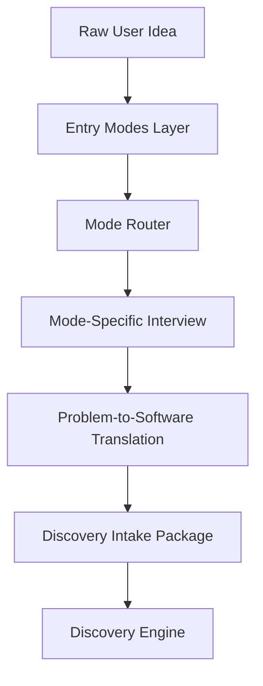

# Entry Modes Layer

## 1. Objective

The Entry Modes Layer is the official entry point of the AI-SEOS lifecycle.

Its purpose is to classify the user, adapt the language and depth of the interaction, and prepare a structured intake package that can be safely consumed by the Discovery Engine.

The Entry Modes Layer exists because not all users can express their needs in software engineering terms.

## 2. Position in the AI-SEOS Lifecycle

The Entry Modes Layer sits before the Discovery Engine.



## 3. Responsibilities

The Entry Modes Layer is responsible for:

- identifying user technical maturity;
- selecting the appropriate interaction mode;
- adapting vocabulary and explanations;
- selecting the right interview protocol;
- preventing premature technical decisions;
- translating real-world problems into structured software concepts;
- producing a Discovery Intake Package;
- preserving engineering rigor regardless of user sophistication.

## 4. Non-Responsibilities

The Entry Modes Layer does not:

- finalize architecture;
- choose final implementation stack;
- create final PRD;
- create final ADRs for architecture decisions;
- replace Discovery Engine;
- replace Product Engine;
- generate implementation code directly;
- pretend that non-technical certainty is technical certainty.

## 5. Mode Selection

The framework supports three official modes:

| Mode | User Profile | Primary Need | Output Style |
|---|---|---|---|
| Non-Technical Builder | Does not know software terms | Guided problem interview | Plain language + translated artifacts |
| Vibe Coder | Uses AI tools but lacks engineering process | Practical guided execution | Step-by-step + guardrails |
| Professional Engineer | Understands software engineering | Technical planning | Full engineering artifacts |

## 6. Mode Router

The Mode Router can work in two ways:

1. explicit selection;
2. inferred selection.

### 6.1 Explicit Selection

The system asks:

> How do you want to use AI-SEOS?
>
> 1. I am not technical and want help turning a problem into a software solution.
> 2. I use AI tools to build and want a practical guided plan.
> 3. I am a developer or technical professional and want complete engineering artifacts.

### 6.2 Inferred Selection

If the user does not select a mode, the system infers from signals.

Non-technical signals:

- uses everyday language;
- describes manual work;
- asks what GitHub, Vercel, API, database or deploy means;
- focuses on solving a personal or business problem;
- cannot answer stack-related questions.

Vibe coder signals:

- mentions Cursor, Codex, Lovable, Replit, Bolt, Claude Code, Gemini CLI;
- asks for prompts;
- wants to build fast;
- knows some terms but lacks architectural confidence;
- wants practical sequence of tasks.

Professional engineer signals:

- mentions stack, architecture, domain model, API, CI/CD, infra, tenancy, observability, security, ADRs;
- asks for trade-offs;
- wants technical documentation.

## 7. Mode Switching

Mode selection is not permanent.

The system may switch or blend modes when necessary.

Examples:

- A non-technical builder may later need a vibe coder handoff.
- A vibe coder may need professional-level architecture review.
- A professional engineer may request a plain-language explanation for stakeholder communication.

Mode switching must be explicit in the generated artifact.

Example:

> The user started in Non-Technical Builder Mode. The system generated a Vibe Coder Handoff Package for implementation.

## 8. Core Output: Discovery Intake Package

All modes must produce a Discovery Intake Package.

Minimum fields:

```yaml
mode: non-technical-builder | vibe-coder | professional-engineer
user_goal: string
problem_statement: string
current_workaround: string
target_users: array
primary_workflows: array
known_constraints: array
assumptions: array
unknowns: array
software_translation:
  candidate_solution_type: string
  candidate_entities: array
  candidate_roles: array
  candidate_features: array
  candidate_integrations: array
  risk_flags: array
recommended_next_step: discovery
```

## 9. Quality Gates

Entry Mode output passes only if:

- the user's intent is clear enough to start Discovery;
- the mode is recorded;
- assumptions are separated from facts;
- non-technical language has been translated into software concepts;
- no final architecture decision was made prematurely;
- the next engine has enough context to continue.

## 10. Anti-Patterns

Avoid:

- asking non-technical users about databases too early;
- pushing Vercel, GitHub, Supabase or any tool before understanding the problem;
- treating vibe coding as permission for low-quality architecture;
- giving professional engineers shallow generic advice;
- hiding risks because the user is non-technical;
- overloading non-technical users with acronyms.

## 11. Canonical Directories

Sprint 5.5 should create:

```text
docs/entry-modes/
frameworks/entry-modes-framework/
protocols/builder-intake/
protocols/mode-router/
templates/entry-modes/
templates/intake/
playbooks/builder-intake/
examples/entry-modes/
```

## 12. Integration With Other Engines

The Entry Modes Layer produces input for Discovery Engine.

It also informs:

- Product Engine: depth of PRD explanation;
- Architecture Engine: level of technical detail exposed to the user;
- Execution Engine: whether to generate developer tasks or AI-agent prompts;
- Documentation Engine: whether to produce plain-language docs;
- Handoff Engine: what type of receiver will continue the work.
