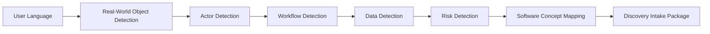

# Mode Router and Problem-to-Software Translation Framework

## 1. Objective

This document defines how AI-SEOS selects an entry mode and translates real-world language into software engineering concepts.

The framework exists to prevent two failures:

1. forcing non-technical users to speak like engineers;
2. allowing vague ideas to enter downstream engines without translation.

## 2. Mode Router

The Mode Router decides which entry mode should handle the initial interaction.

### Explicit Mode Selection

Preferred when possible.

### Inferred Mode Selection

Used when the user does not choose a mode.

## 3. Routing Signals

| Signal | Likely Mode |
|---|---|
| “I do not know how to program” | Non-Technical Builder |
| “I want something to solve my daily problem” | Non-Technical Builder |
| “Give me a prompt for Codex” | Vibe Coder |
| “I am building with Cursor” | Vibe Coder |
| “What stack should I use?” | Vibe Coder or Professional Engineer |
| “Generate ADRs and architecture” | Professional Engineer |
| “We need multi-tenant architecture” | Professional Engineer |

## 4. Translation Pipeline



## 5. Translation Map

| User Says | AI-SEOS Interprets |
|---|---|
| I need to control clients | Customer entity, CRM-like workflow |
| I need to know who paid | Payment tracking, billing status |
| I need to schedule appointments | Calendar, availability, booking workflow |
| I need to send reminders | Notification workflow |
| I need my team to see it | Multi-user access, roles, permissions |
| I want to charge online | Payment integration, financial risk |
| I want students to check in | Attendance, event log, identity validation |
| I want reports | Analytics, aggregation, dashboard |

## 6. Risk Translation

Non-technical signals must be translated into risk flags.

Examples:

| Signal | Risk Flag |
|---|---|
| Stores personal information | Privacy / LGPD / GDPR |
| Handles payments | Financial integrity, reconciliation |
| Multiple people can edit | Authorization, audit trail |
| Public users register | Authentication, abuse prevention |
| Important business process | Reliability, backup |
| Customer communication | Deliverability, consent |

## 7. Output Confidence

Every translation must include confidence.

```yaml
translation_confidence: high | medium | low
needs_follow_up: true | false
```

Low confidence means Discovery must ask follow-up questions before proceeding.

## 8. No Premature Architecture Rule

The Translation Framework may identify candidate solution types, but it must not finalize architecture.

Allowed:

> This likely needs a database and user login.

Not allowed:

> Use Supabase with PostgreSQL and deploy on Vercel.

Final technical choices belong to Architecture and Decision Engines.

## 9. Handoff to Discovery

The output must be stable enough for Discovery Engine to continue without asking the same basic questions again.

Discovery should refine, validate and deepen.

It should not restart from zero.
