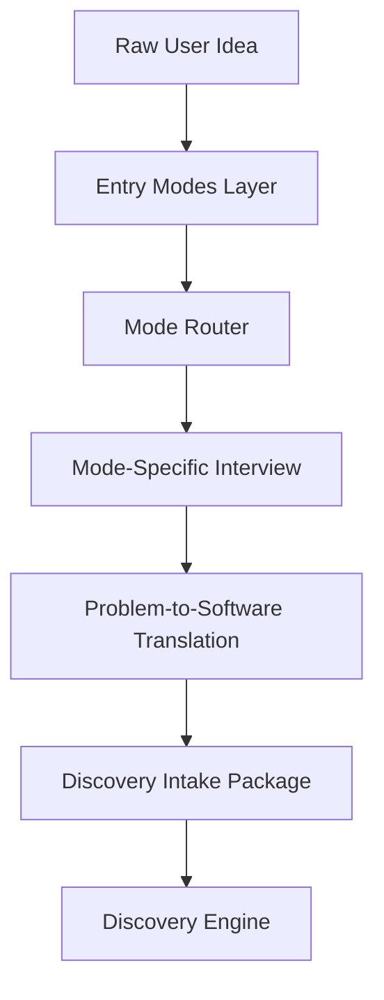

# Entry Modes Layer Overview

## Objetivo

Classificar o usuário, adaptar linguagem e profundidade, e preparar um Discovery Intake Package consumível pelo Discovery Engine.

## Posição no Lifecycle

## Responsabilidades

- Identificar maturidade técnica.
- Selecionar modo apropriado.
- Adaptar vocabulário.
- Evitar decisões técnicas prematuras.
- Traduzir problemas reais em conceitos de software.
- Produzir Discovery Intake Package.

## Não Responsabilidades

Não finaliza arquitetura, stack, PRD, ADRs ou código.

## Quality Gates

- Intent is clear enough to start Discovery.
- Mode is recorded.
- Assumptions are separated from facts.
- Real-world language is translated.
- No final architecture decision is made prematurely.
