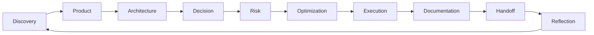

# Framework Map

## Objetivo

Mapear relações entre engines, frameworks, protocolos e templates.

| Engine | Framework | Protocol | Key Templates |
| --- | --- | --- | --- |
| Discovery | Discovery Framework | Project Discovery | discovery document, assumptions, constraints |
| Product | Product Framework | Product Definition | PRD, MVP, roadmap |
| Architecture | Architecture Framework | Architecture Review | architecture overview, decision matrix |
| Decision | Decision Framework | Decision Review | decision record, ADR |
| Risk | Risk Framework | Risk Assessment | risk register, risk assessment |
| Optimization | Optimization Framework | Optimization Review | optimization review, cost model |
| Execution | Execution Framework | Execution Planning | execution plan, work package |
| Documentation | Documentation Framework | Documentation Maintenance | documentation review checklist |
| Handoff | Handoff Framework | Handoff | handoff package |
| Reflection | Reflection Framework | Reflection Review | retrospective, improvement backlog |

## Cross-Engine Flow

