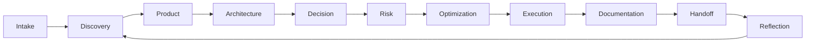

# AI-SEOS Meta-Framework

## Objetivo

Compor todos os engines e frameworks em um operating path único.

## Estágios

0. Intake.
1. Discovery.
2. Product Definition.
3. Architecture Design.
4. Decision Review.
5. Risk Assessment.
6. Optimization.
7. Execution Planning.
8. Documentation.
9. Handoff.
10. Reflection.

## Fluxo

