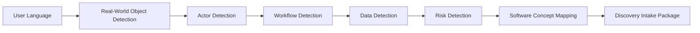

# Problem-to-Software Translation Framework

## Objetivo

Traduzir linguagem cotidiana em conceitos de engenharia sem forçar usuários a falarem como engenheiros.

## Pipeline

## Translation Map

| User Says | AI-SEOS Interprets |
| --- | --- |
| I need to control clients | Customer entity, CRM-like workflow |
| I need to know who paid | Payment tracking, billing status |
| I need to schedule appointments | Calendar, availability, booking workflow |
| I need to send reminders | Notification workflow |
| I need my team to see it | Multi-user access, roles, permissions |
| I want to charge online | Payment integration, financial risk |

## Risk Translation

| Signal | Risk Flag |
| --- | --- |
| Stores personal information | Privacy / LGPD / GDPR |
| Handles payments | Financial integrity, reconciliation |
| Multiple people can edit | Authorization, audit trail |
| Public users register | Authentication, abuse prevention |

## Rule

The framework may identify candidate solution types, but must not finalize architecture or stack.
