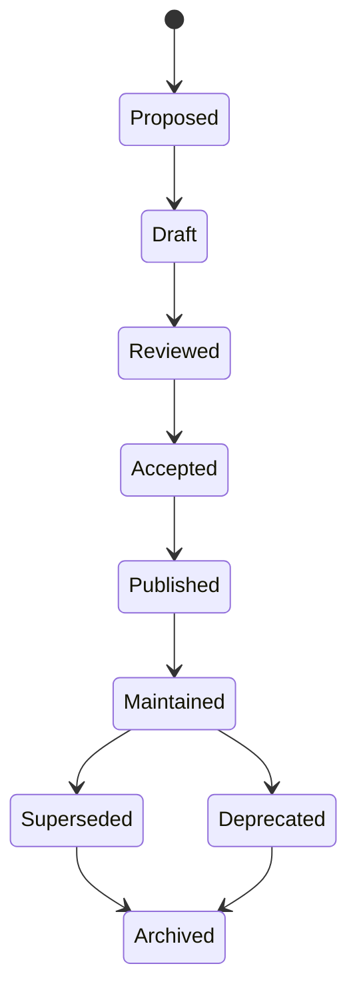

# Documentation Lifecycle

## Objetivo

Definir estados de maturidade e manutenção documental.

## Fluxo

## Estados

- Proposed: documento necessário ainda não redigido.
- Draft: conteúdo inicial não estável.
- Reviewed: revisado para estrutura e consistência.
- Accepted: canônico para a versão atual.
- Published: disponível para uso.
- Maintained: atualizado conforme realidade muda.
- Superseded, Deprecated, Archived: estados históricos ou substituídos.
