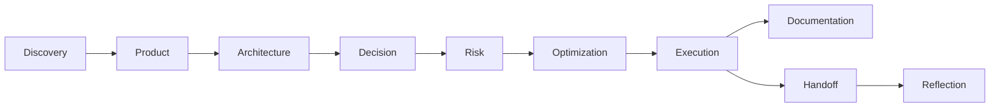

# Execution Engine

## Objetivo

Converter estratégia, escopo, arquitetura, decisões, riscos e otimizações em um caminho de entrega controlado.

## Contexto

AI-SEOS evita que planejamento vire apenas documentação. A Execution Engine cria sequência, work packages, gates e release readiness para que humanos e agentes implementem com contexto suficiente.

## Entradas

- Discovery Summary, PRD, MVP Scope e Product Roadmap.
- Architecture Overview, Domain Model e Integration Model.
- Decision Matrix, ADRs e Decision Log.
- Risk Register e Optimization Review.
- Context Package e estado atual do repositório.

## Saídas

- Execution Plan.
- Milestone Plan.
- Sprint Plan.
- Technical Backlog.
- Work Packages.
- Dependency Map.
- Execution Readiness Report.
- Release Candidate Checklist.
- Implementation Handoff Package.

## Fluxo

## Responsabilidades

- Avaliar readiness antes da implementação.
- Sequenciar trabalho por valor, risco e dependência.
- Decompor trabalho em unidades revisáveis.
- Definir gates de qualidade.
- Preparar handoffs para agentes e humanos.

## Riscos

- Scope drift.
- Architecture erosion.
- Risk blindness.
- Agent fragmentation.
- Premature coding.

## Quality Gates

- Intake Gate.
- Planning Gate.
- Implementation Gate.
- Release Candidate Gate.

## Próximos passos

- Usar `protocols/execution-planning/execution-planning-protocol.md`.
- Produzir `templates/execution/execution-readiness-report-template.md` antes de iniciar implementação.
