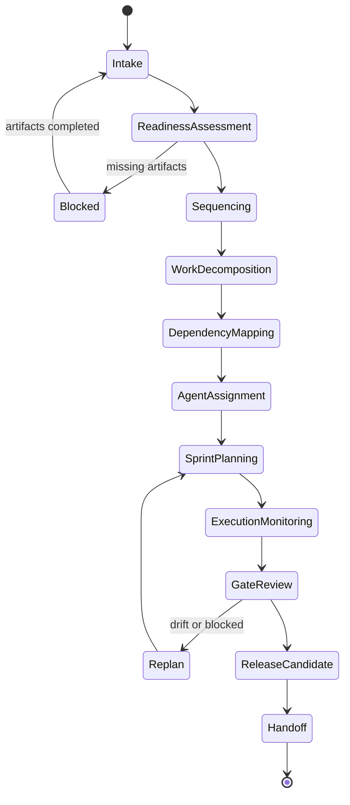

# Execution Lifecycle

## Objetivo

Definir os estados pelos quais uma iniciativa passa do intake até o handoff.

## Fluxo

## Responsabilidades

- Cada transição exige evidência.
- Estados bloqueados devem registrar gap, owner e próxima ação.
- Replanejamento deve preservar rastreabilidade.

## Próximos passos

- Aplicar este lifecycle em todo execution plan.
