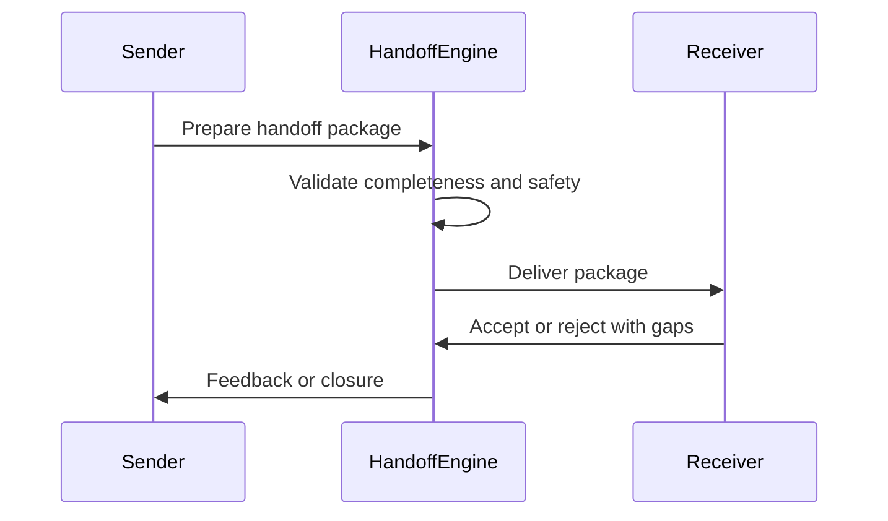

# Handoff Engine

## Objetivo

Garantir que todo receptor possa agir com segurança sem redescobrir contexto, adivinhar prioridades ou violar decisões anteriores.

## Escopo

- Phase-to-phase handoff.
- Agent-to-agent handoff.
- Human-to-agent e agent-to-human handoff.
- Sprint, implementation, review, release e operational handoff.
- Failure escalation handoff.

## Entradas

Context packages, upstream artifacts, ADRs, risks, constraints, expected outputs, quality gates e open questions.

## Saídas

Handoff Package, Handoff Contract, Handoff Receipt, Handoff Gap e completion evidence.

## Fluxo

## Anti-patterns

- "See previous chat" as handoff.
- Tasks without context.
- Handoff without acceptance criteria.
- Handoff without related ADRs.
- Handoff without escalation rules.
