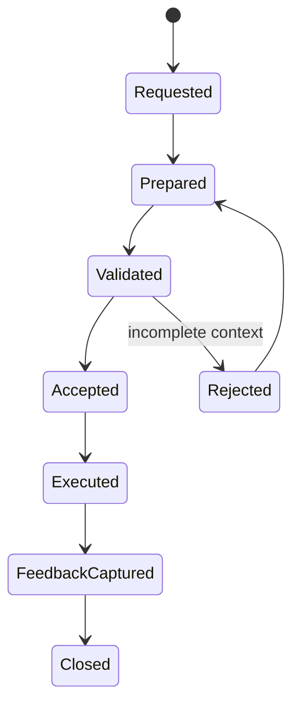

# Handoff Lifecycle

## Objetivo

Definir estados de transferência de responsabilidade.

## Fluxo

## Regras

- Handoff rejeitado volta para prepared com gaps explícitos.
- Handoff aceito deve registrar receiver acknowledgement.
- Feedback capturado alimenta Reflection Engine.
