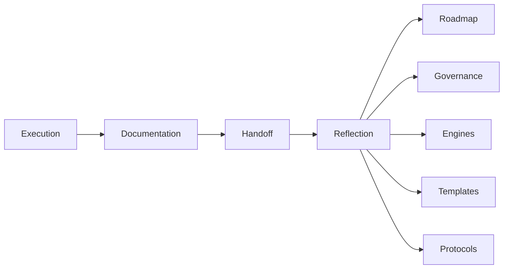

# Reflection Engine

## Objetivo

Fechar o learning loop do AI-SEOS detectando padrões, gaps, riscos recorrentes, drift documental, friction de execução e melhorias sistêmicas.

## Escopo

- Sprint retrospectives.
- Architecture, decision, risk, documentation and handoff reviews.
- Agent performance reviews.
- Protocol and quality gate improvement.
- Lessons learned and improvement backlog.

## Não Escopo

Não culpa humanos ou agentes, não reescreve histórico e não aprova mudanças estruturais sem governança.

## Integração

## Quality Gates

- Evidence Gate.
- Specificity Gate.
- Actionability Gate.
- Learning Gate.
