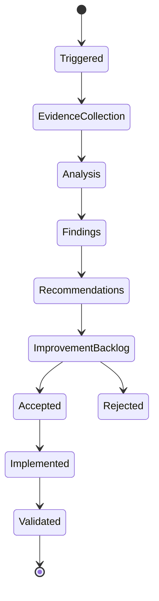

# Reflection Lifecycle

## Objetivo

Definir como uma revisão evolui de trigger até aprendizado validado.

## Fluxo

## Triggers

Fim de sprint, ADR relevante, mudança arquitetural, release candidate, incidente, handoff rejeitado, drift documental ou quality gate falho.
